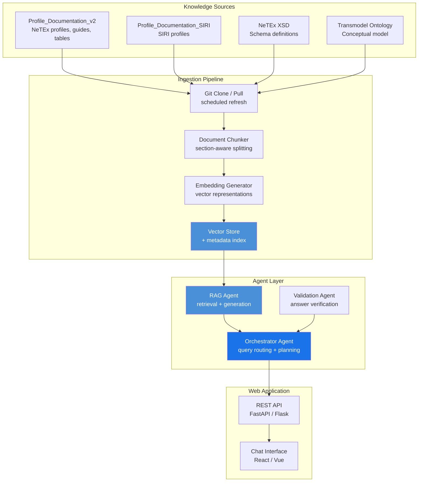
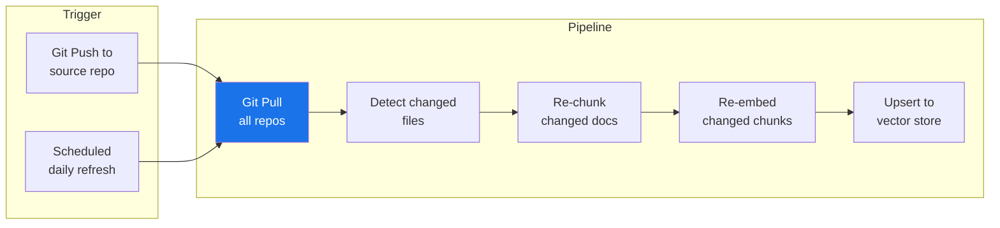

# 🤖 Agent-Based Helpdesk for Transmodel Standards — System Guide

## 1. 🎯 Introduction

The Transmodel standard ecosystem (NeTEx, SIRI, Transmodel) spans thousands of pages of specifications, profiles, and implementation guides across multiple Git repositories. Standards implementers — from operators building their first NeTEx delivery to developers integrating journey planning APIs — frequently need answers to specific questions:

- *"Which frame does DestinationDisplay belong to?"*
- *"Is VehicleTypeRef mandatory in the Nordic Profile?"*
- *"How do I model a replacement journey in SIRI-ET?"*
- *"What are the differences between EPIP and the Nordic Profile for StopPlace?"*

Today, finding these answers requires searching across repositories, reading lengthy specification documents, and cross-referencing tables. An **agent-based helpdesk** can provide instant, accurate answers grounded in the canonical source material.

This guide documents the architecture and design of a web application that serves as an intelligent helpdesk for the Transmodel standard ecosystem, developed within the [NAPCORE](https://napcore.eu/) project.

---

## 2. 🎯 Design Principles

| Principle | Description |
|-----------|-------------|
| **Grounded answers** | Every response is backed by content from the canonical repositories — no hallucination |
| **Source attribution** | Answers include links to the specific files, sections, and line numbers in the source material |
| **Multi-repository** | Queries span the full Transmodel ecosystem, not just a single repository |
| **Profile-aware** | The system understands that profiles (ERP, NP, SI, FR) constrain the base standard differently |
| **Up to date** | Knowledge is refreshed from Git repositories, not frozen in a training snapshot |

---

## 3. 🏗️ System Architecture

### High-Level Overview



### Component Responsibilities

| Component | Purpose | Technology Options |
|-----------|---------|-------------------|
| **Git Clone / Pull** | Keep local mirror of knowledge repositories current | Git scheduled jobs (cron / GitHub Actions) |
| **Document Chunker** | Split markdown, XML, and TTL files into semantically meaningful chunks | LangChain / LlamaIndex document loaders |
| **Embedding Generator** | Create vector embeddings for semantic search | OpenAI `text-embedding-3-large`, Cohere, local models |
| **Vector Store** | Store and retrieve embeddings by semantic similarity | Qdrant, Pinecone, Chroma, pgvector |
| **Orchestrator Agent** | Route user queries, plan multi-step reasoning, combine agent outputs | LangChain Agent / LlamaIndex Agent |
| **RAG Agent** | Retrieve relevant chunks and generate grounded answers | Retrieval-Augmented Generation pipeline |
| **Validation Agent** | Verify answer accuracy against source material | Cross-check agent with separate retrieval |
| **REST API** | Expose agent capabilities to the web frontend | FastAPI |
| **Chat Interface** | User-facing conversational UI | React with streaming support |

---

## 4. 📚 Knowledge Repositories

The helpdesk draws from multiple Git repositories in the Transmodel ecosystem:

### Repository Map

| Repository | Content | Key File Types |
|-----------|---------|----------------|
| **Profile_Documentation_v2** | NeTEx profile guides, object tables, examples, ontology | `.md`, `.xml`, `.ttl` |
| **Profile_Documentation_SIRI** | SIRI profile guides and tables | `.md`, `.xml` |
| **NeTEx XSD** | Official NeTEx XML schema definitions | `.xsd` |
| **Transmodel Ontology** | Conceptual data model as RDF/OWL | `.ttl`, `.rdf` |

### Document Types and Their Roles

| Document Type | Pattern | Purpose in Helpdesk |
|---------------|---------|---------------------|
| **Description files** | `Description_*.md` | Explain what an object is and how it works |
| **Table files** | `Table_*.md` | Field-level reference: type, cardinality, profile constraints |
| **Example files** | `Example_*.xml` | Show correct usage in context |
| **Guide files** | `*_Guide.md` | Cross-cutting topics, decision guidance |
| **Ontology** | `netex-ontology.ttl` | Machine-readable relationships and profile restrictions |
| **XSD schemas** | `*.xsd` | Authoritative type definitions and constraints |

### The Ontology as Knowledge Backbone

The [netex-ontology.ttl](../../LLM/netex-ontology.ttl) file serves as a structured entry point for the agent:

```text
User question: "What frame does ServiceJourney belong to?"

Agent reasoning:
  1. Query ontology for netex:ServiceJourney → netex:inFrame → ?
  2. Result: netex:TimetableFrame
  3. Follow doc:table link → Objects/ServiceJourney/Table_ServiceJourney.md
  4. Return answer with source attribution
```

The ontology encodes:
- **Frame containment** — which objects live in which frames
- **Relationships** — `@ref` properties between objects, with cardinality
- **Profile restrictions** — what ERP and NP allow, exclude, or require differently
- **Domain chains** — common navigation paths (e.g. Line → Route → JourneyPattern)
- **SIRI bridges** — which NeTEx objects are referenced by which SIRI services
- **Documentation links** — `doc:description`, `doc:table`, `doc:example` pointers

---

## 5. 🔍 Retrieval Strategy

### 5.1 Two-Stage Retrieval

Simple vector search is insufficient for standards documentation — a question about cardinality in the Nordic Profile requires precise table lookups, not fuzzy semantic matching. The helpdesk uses a two-stage approach:

```text
Stage 1: Semantic search (broad recall)
  → Vector similarity over document chunks
  → Returns ~20 candidate chunks

Stage 2: Structured lookup (precision)
  → Ontology query for frame, profile, and relationship metadata
  → Table file lookup for exact cardinality and constraints
  → XSD query for authoritative type definitions
  → Returns precise, verified facts
```

### 5.2 Chunking Strategy

Different document types require different chunking approaches:

| Document Type | Chunking Strategy | Chunk Size |
|---------------|-------------------|------------|
| Guide (`.md`) | Section-based (split on `## ` headers) | ~500–1000 tokens |
| Table (`.md`) | Row-based (each table row as a chunk with header context) | ~100–200 tokens |
| Description (`.md`) | Section-based | ~500–1000 tokens |
| Example (`.xml`) | Whole-file (keep XML context intact) | Variable |
| Ontology (`.ttl`) | Triple-group (cluster related triples) | ~200–500 tokens |
| Schema (`.xsd`) | Type-based (one chunk per `complexType` / `element`) | Variable |

### 5.3 Metadata Enrichment

Each chunk is stored with metadata enabling filtered retrieval:

```json
{
  "content": "ServiceJourney refers to a planned trip...",
  "metadata": {
    "source_repo": "Profile_Documentation_v2",
    "file_path": "Objects/ServiceJourney/Description_ServiceJourney.md",
    "section": "Introduction",
    "object_type": "ServiceJourney",
    "frame": "TimetableFrame",
    "doc_type": "description",
    "profiles": ["ERP", "NP"]
  }
}
```

This enables queries like: *"Find all table entries for ServiceJourney in the Nordic Profile"* — the agent can filter by `object_type`, `doc_type`, and `profiles` before running semantic search.

---

## 6. 🤖 Agent Design

### 6.1 Multi-Agent Architecture

The system uses specialised agents coordinated by an orchestrator:

```text
┌─────────────────────────────────────────────────────┐
│                  Orchestrator Agent                  │
│  Analyses query → selects strategy → combines       │
│  results → formats response                         │
└───────────┬────────────┬────────────┬───────────────┘
            │            │            │
     ┌──────▼──────┐ ┌──▼──────┐ ┌──▼────────────┐
     │ RAG Agent   │ │ Ontology│ │ Validation    │
     │             │ │ Agent   │ │ Agent         │
     │ Retrieves   │ │         │ │               │
     │ docs, builds│ │ Queries │ │ Cross-checks  │
     │ answer from │ │ TTL for │ │ answer against│
     │ chunks      │ │ struct. │ │ source tables │
     │             │ │ facts   │ │ and schemas   │
     └─────────────┘ └─────────┘ └───────────────┘
```

### 6.2 Agent Roles

| Agent | Trigger | Input | Output |
|-------|---------|-------|--------|
| **Orchestrator** | Every query | User question | Final answer + sources |
| **RAG Agent** | General questions, explanations | Query + metadata filters | Text answer + source chunks |
| **Ontology Agent** | Structural questions (frames, relationships, profiles) | SPARQL-like query | Structured facts from TTL |
| **Validation Agent** | After RAG/Ontology produce an answer | Draft answer + source chunks | Verified/corrected answer |

### 6.3 Query Routing Examples

| User Question | Route | Reasoning |
|---------------|-------|-----------|
| *"What is a ServiceJourney?"* | RAG → Description file | Conceptual explanation needed |
| *"Is VehicleTypeRef mandatory in NP?"* | Ontology → Table file | Profile constraint lookup |
| *"Show me an example of DayTypeAssignment"* | RAG → Example file | XML example retrieval |
| *"How do NeTEx and SIRI relate?"* | RAG → Guide files | Cross-cutting topic |
| *"List all objects in ServiceFrame"* | Ontology | Structural containment query |
| *"Differences between EPIP and NP for StopPlace"* | Ontology → Table → RAG | Multi-step comparison |

---

## 7. ✅ Answer Verification

Hallucination prevention is critical for a standards helpdesk — wrong answers about cardinality or profile requirements directly cause invalid data deliveries.

### Verification Pipeline

```text
1. RAG Agent produces draft answer with source citations
2. Validation Agent:
   a. Retrieves the cited source chunks independently
   b. Verifies each factual claim against the source text
   c. Checks profile-specific claims against ontology restrictions
   d. Flags unsupported claims
3. Orchestrator:
   a. If all claims verified → return answer
   b. If claims flagged → revise answer or add caveats
```

### Confidence Levels

| Level | Meaning | Display |
|-------|---------|---------|
| **High** | Answer fully supported by source material | Green indicator |
| **Medium** | Answer partially supported; some inference involved | Yellow indicator |
| **Low** | Answer requires interpretation not directly in sources | Red indicator + caveat |
| **Not found** | No relevant source material found | Explicit "I don't know" + suggestion |

> [!WARNING]
> The system should **never fabricate** NeTEx cardinality, profile rules, or element names. If the information is not in the knowledge base, the correct answer is "I don't have this information — please check the official specification."

---

## 8. 🌐 Web Application Design

### 8.1 User Interface

The web application provides a chat-based interface with supporting features:

```text
┌───────────────────────────────────────────────────────┐
│  🤖 NeTEx / Transmodel Helpdesk              [NAPCORE] │
├───────────────────────────────────────────────────────┤
│                                                       │
│  Profile scope: [Nordic Profile ▼]                    │
│                                                       │
│  ┌─────────────────────────────────────────────────┐  │
│  │ User: Is VehicleTypeRef mandatory for Vehicle?  │  │
│  ├─────────────────────────────────────────────────┤  │
│  │ Agent: Yes, in the Nordic Profile (NP),         │  │
│  │ VehicleTypeRef is mandatory (1..1) for Vehicle. │  │
│  │ The XSD allows 0..1, but the NP profile         │  │
│  │ tightens this to require it.                    │  │
│  │                                                 │  │
│  │ 📎 Sources:                                     │  │
│  │  • Table_Vehicle.md (line 12)                   │  │
│  │  • netex-ontology.ttl (profile:NP requires)     │  │
│  │                                                 │  │
│  │ Confidence: ██████████ High                     │  │
│  └─────────────────────────────────────────────────┘  │
│                                                       │
│  ┌─────────────────────────────────────────────────┐  │
│  │ Ask a question...                          [⏎]  │  │
│  └─────────────────────────────────────────────────┘  │
│                                                       │
│  Quick topics: [StopPlace] [ServiceJourney] [SIRI-ET] │
└───────────────────────────────────────────────────────┘
```

### 8.2 Key Features

| Feature | Description |
|---------|-------------|
| **Profile selector** | Filter answers by profile (ERP, NP, SI, FR, etc.) |
| **Source links** | Click-through to the exact file and line in the Git repository |
| **Confidence indicator** | Visual indicator of answer reliability |
| **Quick topics** | Pre-built queries for common objects and concepts |
| **Conversation history** | Multi-turn conversations with context retention |
| **Export** | Copy answer as markdown or share via link |
| **Feedback** | Thumbs up/down to improve retrieval quality over time |

### 8.3 Technology Stack

| Layer | Recommended Technology | Rationale |
|-------|----------------------|-----------|
| **Frontend** | React + TypeScript | Component-based, streaming support |
| **Backend API** | FastAPI (Python) | Async support, OpenAPI docs, LangChain integration |
| **Agent framework** | LangChain / LlamaIndex | Mature RAG and agent tooling |
| **LLM** | Claude / GPT-4 / Mistral (configurable) | Configurable model backend |
| **Vector store** | Qdrant or pgvector | Self-hostable, production-ready |
| **Embedding model** | OpenAI `text-embedding-3-large` or Cohere | High-quality semantic embeddings |
| **Deployment** | Docker Compose → Kubernetes | Reproducible, scalable |
| **CI/CD** | GitHub Actions | Automated knowledge refresh on push |

---

## 9. 🔄 Knowledge Refresh Pipeline

The helpdesk stays current through automated ingestion:



**Incremental refresh**: Only re-process files that changed since the last sync, identified by `git diff`. This keeps latency low and avoids unnecessary recomputation.

---

## 10. 🔐 Security and Governance

| Concern | Mitigation |
|---------|------------|
| **Data access** | Only public/shared repository content is indexed — no credentials or private data |
| **Prompt injection** | Input sanitisation + system prompt boundaries prevent manipulation |
| **Answer liability** | Confidence levels and source attribution let users verify claims |
| **API access** | Token-based authentication for API consumers |
| **Rate limiting** | Per-user and per-IP rate limits prevent abuse |
| **Audit trail** | All queries and responses logged for quality monitoring |

---

## 11. 📋 Roadmap — NAPCORE Helpdesk Milestones

| Phase | Scope | Key Deliverables |
|-------|-------|-----------------|
| **Phase 1 — MVP** | Single repo (Profile_Documentation_v2), basic RAG | Chat UI, vector search, source links |
| **Phase 2 — Multi-repo** | Add SIRI, XSD, Transmodel repos | Cross-repo queries, ontology agent |
| **Phase 3 — Profile-aware** | Profile filtering, comparison queries | "diff NP vs ERP for StopPlace" |
| **Phase 4 — Validation agent** | Answer verification, confidence scoring | High-reliability answers |
| **Phase 5 — Community** | Feedback loop, usage analytics, public deployment | Continuous improvement |

---

## 12. 🔗 Related Resources

### Guides in This Repository
- [Decision Makers](../DecisionMakers/DecisionMakers_Guide.md) — NeTEx overview for stakeholders
- [IT Architecture](../ITArchitecture/ITArchitecture_Guide.md) — Data exchange architecture and actor roles
- [MaaS Consumers](../MaaSConsumers/MaaSConsumers_Guide.md) — Consuming NeTEx datasets
- [Tools](../Tools/Tools_Guide.md) — Editors, validators, and development workflow

### External
- [NAPCORE](https://napcore.eu/) — EU project coordinating National Access Points
- [LangChain](https://python.langchain.com/) — Framework for LLM-powered applications
- [LlamaIndex](https://www.llamaindex.ai/) — Data framework for LLM applications
- [Qdrant](https://qdrant.tech/) — Vector search engine
- [FastAPI](https://fastapi.tiangolo.com/) — High-performance Python web framework
