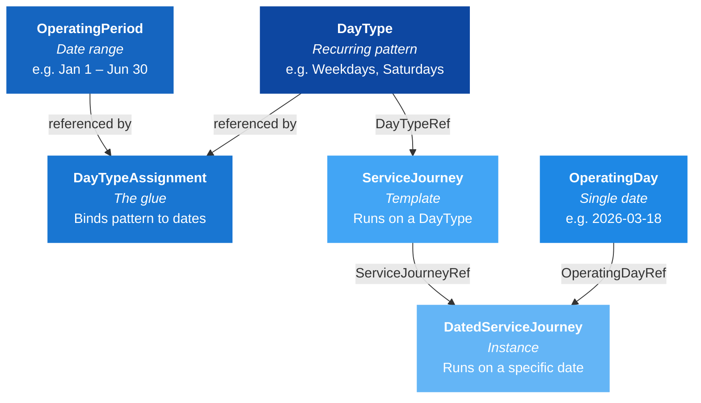
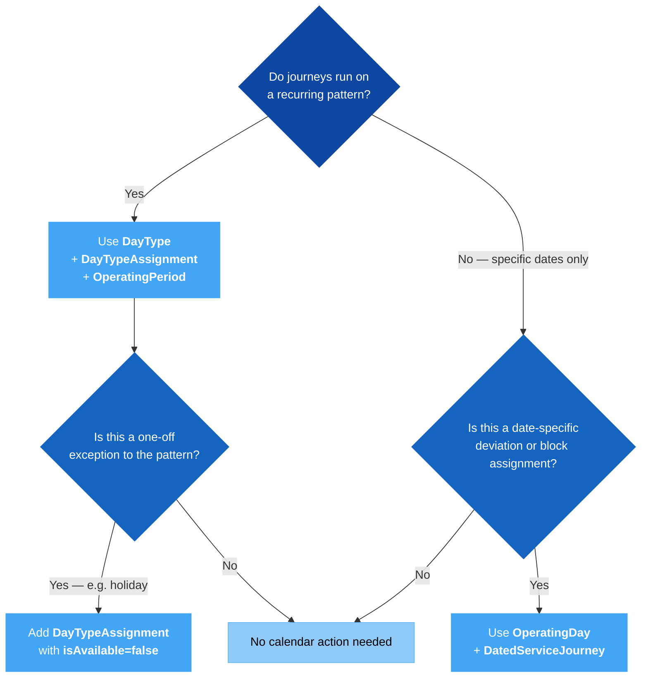

# 📅 Calendar — When Services Operate

## 1. 🎯 Introduction

A timetable answers two questions: *what runs?* and *when does it run?* The journey lifecycle guides cover the first question (Line → Route → JourneyPattern → ServiceJourney). This guide covers the second — the calendar model that determines which dates a service operates on, and how to handle exceptions like holidays.

In this guide you will learn:
- 🧩 The four calendar objects: **DayType**, **OperatingPeriod**, **DayTypeAssignment**, and **OperatingDay**
- 🔗 How they connect to **ServiceJourney** and **DatedServiceJourney**
- 🚫 How to model **exceptions** (holidays, one-off closures) using `isAvailable=false`
- 🗓️ The difference between **pattern-based** and **date-based** scheduling
- 📝 Worked XML examples for each scenario

---

## 2. 🧩 The Four Calendar Objects

All calendar data lives in the **ServiceCalendarFrame**. Four objects work together:



| Object | What it represents | Defined in | Referenced by |
|--------|--------------------|------------|---------------|
| **DayType** | A recurring day pattern (e.g., "Weekdays") | ServiceCalendarFrame | ServiceJourney via `DayTypeRef`; DayTypeAssignment via `DayTypeRef` |
| **OperatingPeriod** | A date range (FromDate → ToDate) | ServiceCalendarFrame | DayTypeAssignment via `OperatingPeriodRef` |
| **DayTypeAssignment** | The binding between a DayType and a date range or specific date | ServiceCalendarFrame | — (it's the glue, not typically referenced by others) |
| **OperatingDay** | A single calendar date | ServiceCalendarFrame | DatedServiceJourney via `OperatingDayRef` |

> 💡 **Key insight:** DayType says *which kind of day*. OperatingPeriod says *during which date range*. DayTypeAssignment connects the two, and also handles exceptions. OperatingDay is a completely separate path — for date-specific instances.

---

## 3. 🔗 Pattern-Based vs Date-Based Scheduling

NeTEx provides two distinct mechanisms for controlling when journeys operate. Choosing the right one is a fundamental design decision.

| Mechanism | Objects involved | Used for |
|-----------|-----------------|----------|
| **Pattern-based** | DayType + DayTypeAssignment + OperatingPeriod → ServiceJourney | Recurring schedules: "every weekday from Jan to Jun" |
| **Date-based** | OperatingDay → DatedServiceJourney | Specific dates: cancellations, replacements, reinforcements, block assignments |

### Pattern-Based: The Recurring Schedule

This is the primary mechanism for the yearly timetable. A ServiceJourney says "I run on Weekdays" by referencing a DayType. The DayTypeAssignment then resolves "Weekdays" to actual calendar dates within an OperatingPeriod.

```xml
<!-- 1. Define the pattern -->
<DayType id="ERP:DayType:Weekdays" version="1">
  <Name>Weekdays</Name>
  <properties>
    <PropertyOfDay>
      <DaysOfWeek>Monday Tuesday Wednesday Thursday Friday</DaysOfWeek>
    </PropertyOfDay>
  </properties>
</DayType>

<!-- 2. Define the date range -->
<OperatingPeriod id="ERP:OperatingPeriod:2026H1" version="1">
  <FromDate>2026-01-01T00:00:00Z</FromDate>
  <ToDate>2026-06-30T00:00:00Z</ToDate>
</OperatingPeriod>

<!-- 3. Bind pattern to date range -->
<DayTypeAssignment id="ERP:DayTypeAssignment:WKD_2026H1" version="1" order="1">
  <OperatingPeriodRef ref="ERP:OperatingPeriod:2026H1"/>
  <DayTypeRef ref="ERP:DayType:Weekdays"/>
  <isAvailable>true</isAvailable>
</DayTypeAssignment>

<!-- 4. ServiceJourney references the DayType -->
<ServiceJourney id="ERP:ServiceJourney:100_0730" version="1">
  <dayTypes>
    <DayTypeRef ref="ERP:DayType:Weekdays"/>
  </dayTypes>
  <!-- ... passingTimes ... -->
</ServiceJourney>
```

> ⚠️ **Critical:** A DayType without a DayTypeAssignment is inert. The ServiceJourney references it, but no calendar dates are resolved — the journey will never operate. This is the most common calendar mistake.

### Date-Based: The Specific Instance

When a journey needs to be tracked on a specific date — whether for deviation handling, ticket sales, or vehicle block assignment — use OperatingDay + DatedServiceJourney.

```xml
<!-- Define the date -->
<OperatingDay id="ERP:OperatingDay:2026-03-18" version="1">
  <CalendarDate>2026-03-18</CalendarDate>
</OperatingDay>

<!-- Create a dated instance -->
<DatedServiceJourney id="ERP:DatedServiceJourney:100_0730_20260318" version="1">
  <ServiceJourneyRef ref="ERP:ServiceJourney:100_0730"/>
  <OperatingDayRef ref="ERP:OperatingDay:2026-03-18"/>
</DatedServiceJourney>
```

> 💡 **Tip:** Pattern-based and date-based scheduling work together. The ServiceJourney template defines the recurring schedule via DayType. DatedServiceJourney then handles exceptions and date-specific operations on top of that template. See the [Extended Sales & Deviation Handling](../ExtendedSales_and_DeviationHandling/ExtendedSales_and_DeviationHandling_Guide.md) guide for the full deviation model.

---

## 4. 🚫 Handling Exceptions: The `isAvailable` Pattern

Real-world schedules have exceptions: public holidays, one-off closures, seasonal changes. NeTEx handles these by stacking DayTypeAssignments with `isAvailable=false`.

### Example: Weekdays Except Christmas Day

```xml
<!-- Base assignment: weekdays in 2026 -->
<DayTypeAssignment id="ERP:DayTypeAssignment:WKD_2026" version="1" order="1">
  <OperatingPeriodRef ref="ERP:OperatingPeriod:2026"/>
  <DayTypeRef ref="ERP:DayType:Weekdays"/>
  <isAvailable>true</isAvailable>
</DayTypeAssignment>

<!-- Exception: Christmas Day falls on a Friday in 2026 — exclude it -->
<DayTypeAssignment id="ERP:DayTypeAssignment:WKD_Christmas" version="1" order="2">
  <Date>2026-12-25</Date>
  <DayTypeRef ref="ERP:DayType:Weekdays"/>
  <isAvailable>false</isAvailable>
</DayTypeAssignment>
```

**How evaluation works:**

1. Assignments are evaluated in `@order` sequence.
2. `order="1"` includes all weekdays in 2026.
3. `order="2"` then excludes December 25 — even though it's a Friday.
4. The result: all weekdays in 2026 except Christmas Day.

> ⚠️ **Order matters.** A `false` assignment must have a higher `@order` than the `true` assignment it overrides. If order is wrong, the exclusion may be overridden by a later inclusion.

### Example: Adding a Special Saturday Service

You can also use `isAvailable=true` to add specific dates that wouldn't normally match the pattern:

```xml
<!-- Saturdays during football season -->
<DayTypeAssignment id="ERP:DayTypeAssignment:SAT_Football" version="1" order="1">
  <Date>2026-04-11</Date>
  <DayTypeRef ref="ERP:DayType:Saturdays"/>
  <isAvailable>true</isAvailable>
</DayTypeAssignment>
```

---

## 5. 🗓️ When to Use Which



| Scenario | Mechanism | Objects |
|----------|-----------|---------|
| "Bus 100 runs every weekday" | Pattern-based | DayType + DayTypeAssignment + OperatingPeriod |
| "No service on Christmas Day" | Pattern-based exception | DayTypeAssignment with `isAvailable=false` |
| "Bus 100 cancelled on March 18" | Date-based | OperatingDay + DatedServiceJourney with `ServiceAlteration=cancellation` |
| "Extra bus for football match on April 11" | Date-based | OperatingDay + DatedServiceJourney with `ServiceAlteration=extraJourney` |
| "Different summer timetable Jun–Aug" | Pattern-based | Separate DayType + OperatingPeriod for summer |

---

## 6. ❌ Common Mistakes

| Mistake | Why It Fails | Fix |
|---------|-------------|-----|
| DayType without DayTypeAssignment | No calendar dates resolved — journey never operates | Always create a DayTypeAssignment binding the DayType to an OperatingPeriod |
| Confusing DayType with OperatingDay | Different mechanisms for different purposes | DayType = recurring pattern; OperatingDay = specific date |
| Wrong `@order` on overlapping DayTypeAssignments | Exception may not override the base rule | Ensure `false` assignments have a higher `@order` than the `true` ones they override |
| Using DayType for a one-off deviation | DayType is for recurring patterns, not single-date exceptions | Use OperatingDay + DatedServiceJourney for date-specific changes |
| OperatingPeriod without FromDate or ToDate | Invalid date range | Both FromDate and ToDate are required |
| Holiday exception without `isAvailable=false` | The date is still included in the pattern | Set `isAvailable` to `false` on the exception DayTypeAssignment |
| Multiple DayTypeAssignments with same `@order` | Evaluation order is ambiguous | Use unique, sequential `@order` values |

---

## 7. ✅ Best Practices

1. **Name DayTypes descriptively.** Use clear labels like "Weekdays", "Saturdays", "School holidays" — not opaque codes. The Name is used in planning tools and timetable displays.

2. **Always pair DayType with DayTypeAssignment.** A DayType without an assignment is dead weight. Validate that every DayType referenced by a ServiceJourney has at least one DayTypeAssignment.

3. **Use `@order` deliberately.** Start at 1 for the base inclusion, then increment for each exception. Document the order logic in comments within the XML if the assignment stack is complex.

4. **Keep OperatingPeriods aligned with timetable periods.** Typically, an OperatingPeriod covers one timetable period (e.g., "2026 Spring", "2026 Summer"). Avoid overlapping OperatingPeriods for the same DayType unless necessary.

5. **Reserve OperatingDay for date-specificity.** Don't define OperatingDay entries for every date in a year — that defeats the purpose of the pattern-based model. OperatingDay is for DatedServiceJourney (deviations, block assignment, sales).

6. **Group calendar data in ServiceCalendarFrame.** All DayTypes, OperatingPeriods, DayTypeAssignments, and OperatingDays belong in the ServiceCalendarFrame — not scattered across other frames.

7. **Handle year boundaries with separate OperatingPeriods.** When a timetable spans a year boundary (e.g., winter 2026–2027), use distinct OperatingPeriods for each calendar year to avoid confusion with holiday exceptions that differ year to year.

---

## 8. 📄 Example: Full Calendar Setup

A complete example showing Weekdays and Saturdays patterns, an OperatingPeriod, DayTypeAssignments with a Christmas exception, and an OperatingDay for a date-specific deviation:

> 📄 **Full example:** [Example_Calendar.xml](Example_Calendar.xml) — A ServiceCalendarFrame with pattern-based schedules, holiday exceptions, and date-based OperatingDays.

---

## 9. 🔗 Related Resources

### Guides
- [Journey Lifecycle](../JourneyLifecycle/JourneyLifecycle_Guide.md) — The full chain from Line to DatedServiceJourney
- [Extended Sales & Deviation Handling](../ExtendedSales_and_DeviationHandling/ExtendedSales_and_DeviationHandling_Guide.md) — How DatedServiceJourney handles cancellations, replacements, and reinforcements
- [Get Started](../GetStarted/GetStarted_Guide.md) — NeTEx fundamentals and document anatomy

### Frames & Objects
- [ServiceCalendarFrame](../../Frames/ServiceCalendarFrame/Table_ServiceCalendarFrame.md) — The frame containing all calendar data
- [DayType](../../Objects/DayType/Table_DayType.md) — Recurring day pattern specification
- [ServiceJourney](../../Objects/ServiceJourney/Table_ServiceJourney.md) — The template that references DayType
- [DatedServiceJourney](../../Objects/DatedServiceJourney/Table_DatedServiceJourney.md) — The dated instance that references OperatingDay

### External
- [NeTEx CEN Standard](https://www.netex-cen.eu/) — Official specification
