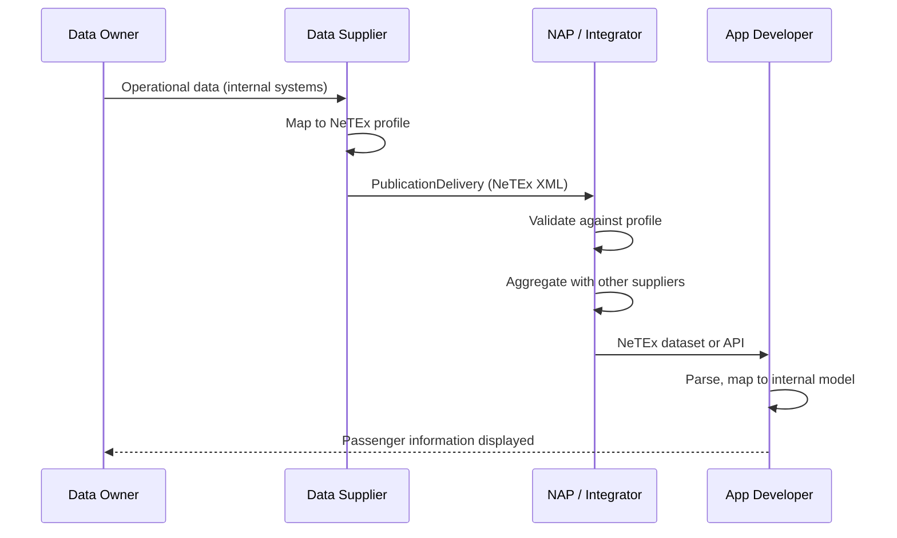
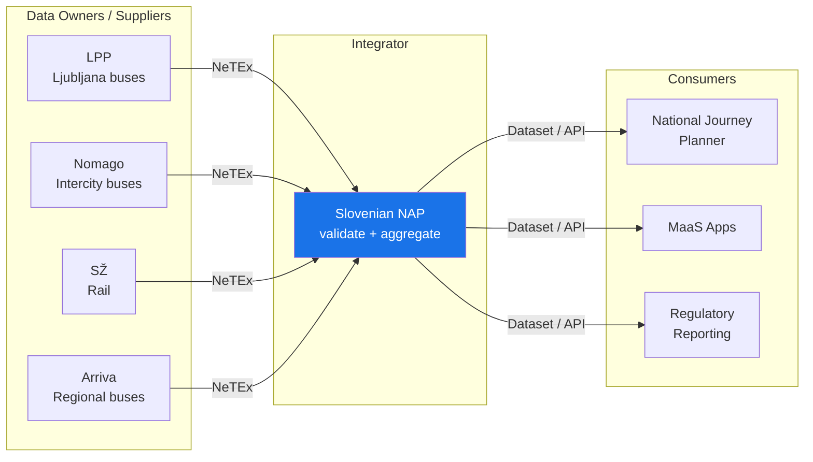
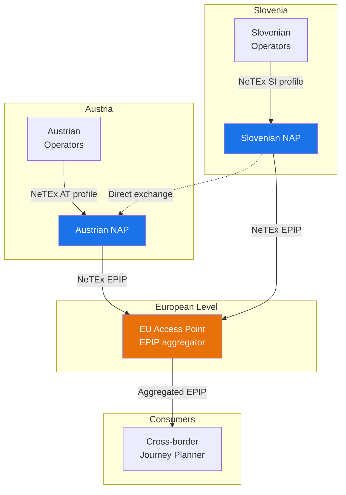
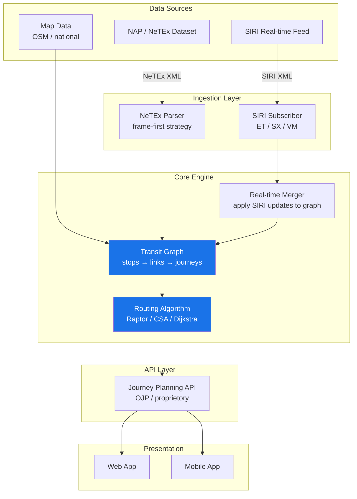

# 🏗️ IT Architecture for Transmodel-Based Data Exchange

## 1. 🎯 Introduction

Public transport data exchange involves multiple actors — data owners, data suppliers, integrators, National Access Points (NAPs), and application developers. Each plays a distinct role in the chain from raw operational data to the passenger-facing journey planner. Understanding these roles and the data flows between them is essential for building interoperable mobility systems.

This guide documents the IT architecture concepts and use cases that support **Transmodel-based data exchange** using NeTEx and SIRI. It covers:
- 🏢 Actor roles and responsibilities in the data ecosystem
- 🔄 Data flow patterns from source to consumer
- 🌍 Local and cross-border exchange scenarios
- 🧩 Integration patterns for NAP and journey planner architectures
- 📡 The interplay between planned data (NeTEx) and real-time data (SIRI)

> [!NOTE]
> This guide focuses on the architectural perspective — *who* exchanges *what* with *whom* and *how*. For the data modelling details, see the domain-specific guides linked throughout.

---

## 2. 🏢 Actors in the Data Ecosystem

Transmodel identifies distinct roles in public transport data exchange. In practice, one organisation may fulfil multiple roles.

### Role Definitions

| Actor | Transmodel Role | Responsibility | Example |
|-------|----------------|----------------|---------|
| **Data Owner** | Authority / Operator | Owns the canonical source data (stops, lines, timetables) | Transport authority, bus operator |
| **Data Supplier** | Producer | Packages and delivers data in NeTEx/SIRI format to consumers | Operator's IT department, contracted data bureau |
| **Integrator** | Aggregator | Collects, validates, and combines data from multiple suppliers | National Access Point (NAP), regional data hub |
| **App Developer** | Consumer | Builds passenger-facing services on top of aggregated data | Journey planner, MaaS platform, real-time display |
| **Regulator** | Authority | Defines rules, profiles, and compliance requirements | Ministry of transport, EU (via Delegated Regulation) |

### Actor Relationships

```text
┌──────────────┐     NeTEx/SIRI      ┌──────────────┐     API / NeTEx     ┌──────────────┐
│  Data Owner  │ ──────────────────> │  Integrator  │ ──────────────────> │     App      │
│  (Authority/ │   (PublicationDel.) │  (NAP / Hub) │   (aggregated)     │  Developer   │
│   Operator)  │                     │              │                     │  (Planner /  │
└──────┬───────┘                     └──────┬───────┘                     │   MaaS)      │
       │                                    │                             └──────────────┘
       │ owns data                          │ validates, combines
       │                                    │ stores, republishes
       v                                    v
  ┌──────────────┐                   ┌──────────────┐
  │ Data Supplier│                   │  Profile &   │
  │ (produces    │                   │  Validation  │
  │  NeTEx XML)  │                   │  Rules       │
  └──────────────┘                   └──────────────┘
```

> [!TIP]
> In the Nordic model (e.g. Norway/Entur), the integrator also maintains **central registries** for stops and organisations. Operators reference these shared objects rather than producing their own, ensuring consistency across the network. See [Organisational Governance](../OrganisationalGovernance/OrganisationalGovernance_Guide.md) for this pattern.

---

## 3. 🔄 Data Flow Patterns

### 3.1 The Core Exchange Pattern

Every Transmodel-based data exchange follows the same fundamental pattern:



### 3.2 Data Ownership Boundaries

Different actors own different parts of the data. This separation is critical for data quality and governance:

| Data Domain | Typically Owned By | NeTEx Frame | Registration |
|-------------|-------------------|-------------|--------------|
| Stop places, quays | Authority / central registry | SiteFrame | Central |
| Organisations | Authority / central registry | ResourceFrame | Central |
| Lines, routes, patterns | Operator | ServiceFrame | Operator delivery |
| Timetables, journeys | Operator | TimetableFrame | Operator delivery |
| Calendar (day types) | Operator | ServiceCalendarFrame | Operator delivery |
| Fares | Authority or operator | FareFrame | Varies |

> [!WARNING]
> Data ownership determines who may create and version an object. An operator **references** a centrally-registered StopPlace by `@ref` — they do not re-define it in their delivery. Violating this principle causes duplicate and conflicting data.

### 3.3 Planned vs Real-Time Data Flow

NeTEx and SIRI serve complementary purposes in the data flow:

```text
                    ┌─────────────────────────────────────────────┐
                    │           PLANNED DATA (NeTEx)              │
                    │  Published periodically (days/weeks ahead)  │
                    │  Stops, Lines, Timetables, Fares            │
                    └────────────────────┬────────────────────────┘
                                         │ provides baseline
                                         v
┌──────────────┐    ┌─────────────────────────────────────────────┐
│ Vehicle AVL  │───>│          REAL-TIME DATA (SIRI)              │
│ system       │    │  Streamed continuously (seconds/minutes)    │
│              │    │  SIRI-ET: updated arrival/departure times   │
└──────────────┘    │  SIRI-SX: disruptions, cancellations        │
                    │  SIRI-VM: vehicle positions                  │
                    └────────────────────┬────────────────────────┘
                                         │ updates baseline
                                         v
                    ┌─────────────────────────────────────────────┐
                    │         JOURNEY PLANNER / APP               │
                    │  Merges NeTEx (planned) + SIRI (real-time)  │
                    │  to show passengers the current situation   │
                    └─────────────────────────────────────────────┘
```

**Key principle:** SIRI messages **reference** NeTEx objects. A SIRI-ET `EstimatedVehicleJourney` identifies the affected journey via `DatedVehicleJourneyRef` (→ DatedServiceJourney) or `FramedVehicleJourneyRef` (→ ServiceJourney). This is why stable NeTEx identifiers are essential.

See the ontology section on [SIRI Real-Time Bridges](../../LLM/netex-ontology.ttl) for the complete mapping of NeTEx objects referenced by each SIRI service.

---

## 4. 🏠 Use Case 1 — Local Data Exchange

The simplest scenario: a single country's operators deliver data to a national integrator, which feeds local journey planners.

### Scenario

A Slovenian bus operator (e.g. Nomago) provides timetable data to the Slovenian NAP, which makes it available to journey planners within Slovenia.

### Architecture



### Data Flow Steps

| Step | Actor | Action | Format |
|------|-------|--------|--------|
| 1 | Operator | Exports timetable from planning system | Internal |
| 2 | Operator (as supplier) | Converts to NeTEx PublicationDelivery following national profile | NeTEx XML |
| 3 | NAP | Receives delivery, validates against profile (schema + rules) | NeTEx XML |
| 4 | NAP | Stores in national dataset, resolves references to central registries | Internal |
| 5 | Journey planner | Downloads aggregated dataset or queries API | NeTEx / API |
| 6 | Journey planner | Parses and indexes for route planning | Internal |

### Profile Requirements

In a local scenario, all actors follow a single national profile:
- Slovenian operators use the **SI / EU_PI** profile (see [Slovenian Profile Analysis](../SlovenianProfile/SlovenianProfile_Analysis.md))
- Nordic operators use the **Nordic Profile (NP)**
- The NAP validates against that profile before accepting data

---

## 5. 🌍 Use Case 2 — Cross-Border Data Exchange

Cross-border scenarios involve multiple NAPs exchanging data so that journey planners can offer routes spanning national boundaries.

### Scenario

A passenger wants to travel from Ljubljana (Slovenia) to Villach (Austria) by bus. The journey planner needs data from both the Slovenian and Austrian NAPs.

### Architecture



### The Role of EPIP

Cross-border exchange requires a **common profile** — this is where EPIP (European Passenger Information Profile) comes in:

| Aspect | National Profile | EPIP |
|--------|-----------------|------|
| Purpose | Full national data exchange | Minimum interoperable subset |
| Scope | All national requirements | Cross-border passenger information |
| Mandatory elements | Profile-specific | Harmonised across EU |
| Stop identifiers | National scheme | Must be resolvable cross-border |
| Language | National language | Multi-language encouraged |

> [!TIP]
> EPIP is a **subset** of national profiles. A valid Nordic Profile delivery is always a valid EPIP delivery (with minor mapping). The reverse is not true — EPIP may lack elements required by a national profile.

### Cross-Border Challenges

| Challenge | Solution |
|-----------|----------|
| **Stop identity** | Shared stop registries or cross-referencing via NaPTAN/IFOPT codes |
| **Different profiles** | EPIP as common denominator for cross-border elements |
| **Language** | `AlternativeName` / `AlternativeText` for multilingual content |
| **Timezone** | `FrameDefaults` in CompositeFrame specifies timezone per delivery |
| **Calendar differences** | National holidays modelled as DayTypes — journey planners must merge calendars |
| **Fare integration** | Out of scope for EPIP; handled bilaterally or via future EU fare profile |

See [Regulatory Compliance](../RegulatoryCompliance/RegulatoryCompliance_Guide.md) for the legal basis (Delegated Regulation 2017/1926) driving cross-border data exchange.

---

## 6. 🧩 Integration Patterns

### 6.1 NAP as Central Aggregator

The most common pattern: operators push NeTEx deliveries to a central NAP, which validates, stores, and republishes.

```text
 Operators                     NAP                          Consumers
 ─────────                  ──────────                    ───────────
 ┌─────┐                   ┌──────────────────┐          ┌──────────┐
 │ Op1 │──NeTEx──>         │                  │          │ Planner  │
 ├─────┤          ┌──>     │  Validation      │──API──>  ├──────────┤
 │ Op2 │──NeTEx──>│        │  Deduplication    │          │ MaaS App │
 ├─────┤          │        │  Reference        │──File──> ├──────────┤
 │ Op3 │──NeTEx──>┘        │  resolution       │          │ Open Data│
 └─────┘                   │  Versioning       │          └──────────┘
                           └──────────────────┘
```

**Responsibilities of the NAP:**
- **Schema validation** — XML against NeTEx XSD
- **Profile validation** — Mandatory elements, cardinality, codespace rules
- **Reference resolution** — Verify that referenced objects (StopPlace, Operator) exist
- **Deduplication** — Prevent conflicting definitions of shared objects
- **Versioning** — Track changes over time, support incremental updates
- **Publication** — Make aggregated datasets available via download or API

### 6.2 Distributed / Federated Exchange

Multiple NAPs exchange data peer-to-peer, without a central EU aggregator:

```text
 ┌──────────┐           ┌──────────┐           ┌──────────┐
 │  NAP-SI  │ <──EPIP──>│  NAP-AT  │ <──EPIP──>│  NAP-DE  │
 │ Slovenia │           │ Austria  │           │ Germany  │
 └──────────┘           └──────────┘           └──────────┘
       │                      │                      │
       v                      v                      v
   Local apps            Local apps             Local apps
```

This pattern is used when bilateral exchange is sufficient and a central hub is not needed.

### 6.3 Hub-and-Spoke (NAPCORE Model)

The [NAPCORE](https://napcore.eu/) project defines a coordinated model where NAPs share metadata and data discovery through a common infrastructure:

```text
                    ┌──────────────────┐
                    │  NAPCORE Hub     │
                    │  (metadata,      │
                    │   discovery,     │
                    │   coordination)  │
                    └────────┬─────────┘
              ┌──────────────┼──────────────┐
              v              v              v
         ┌─────────┐   ┌─────────┐   ┌─────────┐
         │  NAP-SI │   │  NAP-AT │   │  NAP-FR │
         └─────────┘   └─────────┘   └─────────┘
```

NAPCORE enables:
- **Data discovery** — Find which NAP holds data for a given region or service
- **Quality monitoring** — Track data completeness and timeliness across NAPs
- **Profile harmonisation** — Coordinate EPIP interpretation across member states
- **Tooling** — Shared validators, converters, and development tools

---

## 7. 📐 Journey Planner Integration Architecture

A journey planner consumes NeTEx and SIRI data and combines them into a routable graph. Here is a typical system architecture:



### NeTEx Objects Driving the Graph

| Graph Concept | Built From | NeTEx Source |
|---------------|-----------|--------------|
| Stop nodes | StopPlace + Quay positions | SiteFrame |
| Stop connections | PassengerStopAssignment | ServiceFrame |
| Route edges | Route → PointOnRoute chain | ServiceFrame |
| Service patterns | JourneyPattern → StopPointInJourneyPattern | ServiceFrame |
| Timetable edges | ServiceJourney → TimetabledPassingTime | TimetableFrame |
| Transfer edges | Interchange | TimetableFrame |
| Calendar mask | DayType → DayTypeAssignment → date resolution | ServiceCalendarFrame |

See [MaaS Consumers](../MaaSConsumers/MaaSConsumers_Guide.md) for the consumer perspective on parsing NeTEx, including parsing strategies and object mapping.

---

## 8. 🔐 Data Quality and Governance

### Validation Pipeline

A robust data exchange pipeline includes multiple validation stages:

```text
 Supplier side                    NAP side                          Consumer side
 ─────────────                   ──────────                        ─────────────
 ┌──────────────┐               ┌──────────────┐                  ┌──────────────┐
 │ 1. XSD       │               │ 3. XSD       │                  │ 5. Referential│
 │    schema    │               │    schema    │                  │    integrity │
 │    check     │               │    check     │                  │    check     │
 ├──────────────┤               ├──────────────┤                  ├──────────────┤
 │ 2. Profile   │               │ 4. Profile   │                  │ 6. Semantic  │
 │    rules     │               │    rules +   │                  │    validation│
 │    check     │               │    ref check │                  │    (can I    │
 └──────────────┘               └──────────────┘                  │    route it?)│
                                                                  └──────────────┘
```

See [Validation](../Validation/Validation.md) for validation tooling and common error patterns.

### Identifier Governance

Stable, unique identifiers are the foundation of cross-system data exchange:

| Rule | Rationale |
|------|-----------|
| Use Codespace prefixes | Prevents ID collisions between suppliers |
| Never reuse IDs | Old journey planners may cache references |
| Version objects, don't recreate | Enables incremental updates |
| Reference centrally-registered objects by `@ref` | Single source of truth for shared data |

See [NeTEx Conventions](../NeTExConventions/NeTEx_Conventions.md) for ID formatting rules and [Separation of Concerns](../SeparationOfConcerns/SeparationOfConcerns.md) for the data governance model.

---

## 9. 📋 Summary — Architecture Decision Checklist

Use this checklist when designing a Transmodel-based data exchange system:

| Decision | Options | Recommendation |
|----------|---------|----------------|
| **Profile** | EPIP only / National profile / Custom | Start with EPIP, extend to national profile |
| **Exchange pattern** | Push to NAP / Pull from NAP / Peer-to-peer | Push to NAP (most common) |
| **Planned data format** | NeTEx XML / GTFS / proprietary | NeTEx (EU compliant, full expressiveness) |
| **Real-time format** | SIRI / GTFS-RT / proprietary | SIRI (references NeTEx objects) |
| **Stop registry** | Central / per-operator | Central (prevents duplication) |
| **Validation** | Schema only / Schema + profile / Full pipeline | Full pipeline (schema + profile + referential) |
| **Consumer API** | NeTEx download / REST API / OJP | Depends on consumer needs |

---

## 10. 🔗 Related Resources

### Guides in This Repository
- [Decision Makers](../DecisionMakers/DecisionMakers_Guide.md) — NeTEx overview for stakeholders
- [Regulatory Compliance](../RegulatoryCompliance/RegulatoryCompliance_Guide.md) — EU regulation and NAP submission
- [MaaS Consumers](../MaaSConsumers/MaaSConsumers_Guide.md) — Consuming NeTEx datasets
- [Separation of Concerns](../SeparationOfConcerns/SeparationOfConcerns.md) — Data governance and frame boundaries
- [Organisational Governance](../OrganisationalGovernance/OrganisationalGovernance_Guide.md) — Authority, Operator, and data ownership
- [Slovenian Profile](../SlovenianProfile/SlovenianProfile_Analysis.md) — Concrete example of a national delivery
- [Validation](../Validation/Validation.md) — Validation tooling and error patterns

### External
- [NAPCORE](https://napcore.eu/) — EU project coordinating National Access Points
- [NeTEx CEN Standard](https://www.netex-cen.eu/) — Official specification and schemas
- [Transmodel](https://www.transmodel-cen.eu/) — The underlying conceptual data model
- [SIRI](https://www.siri-cen.eu/) — Real-time companion standard
- [EU Delegated Regulation 2017/1926](https://eur-lex.europa.eu/eli/reg_del/2017/1926/oj) — Regulatory basis for data exchange
- [OJP (Open Journey Planning)](https://ojp.io/) — Distributed journey planning interface standard
