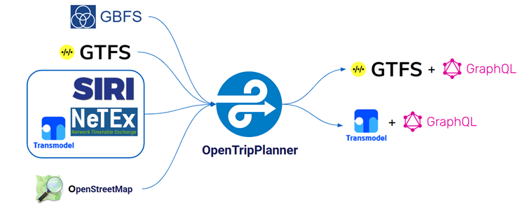

# 🔄 NeTEx for MaaS Providers — Consuming NeTEx Datasets

## 1. 🎯 Introduction

Most NeTEx documentation assumes you are producing data. But if you are building a MaaS platform, journey planner, or integration layer, you are a **consumer** — you receive NeTEx deliveries and need to extract, parse, and map them to your internal models. The challenges are different: instead of asking "am I compliant?", you are asking "can I use this data?".

In this guide you will learn:
- 🔄 How the consumer perspective differs from the producer perspective
- 📄 What to expect inside a NeTEx PublicationDelivery
- 🔍 Two parsing strategies and when to use each
- 🧩 Which NeTEx objects a MaaS platform typically needs
- ⚙️ How to handle profiles and missing data gracefully
- 🗺️ Principles for mapping NeTEx to your internal domain model
- 📡 How NeTEx relates to SIRI for real-time data

---

## 2. 🔄 Consumer vs Producer

Producers (operators, authorities) create NeTEx data following profile rules. Consumers (MaaS apps, journey planners, aggregators) receive and interpret that data. The concerns are fundamentally different:

| Concern | Producer | Consumer |
|---------|----------|----------|
| Primary question | "Am I compliant?" | "Can I use this data?" |
| Data quality | Ensuring completeness and validity | Handling incompleteness gracefully |
| Profile rules | Must follow mandatory elements | Must tolerate optional elements being absent |
| Versioning | Publishes new versions | Detects and processes changes |
| Tooling | XML editors, validators | Parsers, mappers, data pipelines |

> [!TIP]
> Even as a consumer, understanding the producer's constraints helps you anticipate data quality. Read the [Get Started](../GetStarted/GetStarted_Guide.md) guide to understand the structural rules producers follow.

---

## 3. 📄 What to Expect in a NeTEx Delivery

Every NeTEx delivery is a `PublicationDelivery` XML document. The data lives inside `dataObjects`, typically wrapped in a `CompositeFrame`:

```text
PublicationDelivery
 ├── PublicationTimestamp       "When was this published?"
 ├── ParticipantRef             "Who published it?"
 └── dataObjects
      └── CompositeFrame
           ├── ResourceFrame          Authorities, Operators
           ├── SiteFrame              Stops, Quays, Accessibility
           ├── ServiceCalendarFrame   When services run
           ├── ServiceFrame           Lines, Routes, JourneyPatterns
           ├── TimetableFrame         Journeys, passing times
           ├── VehicleScheduleFrame   Vehicle assignments (may be absent)
           └── FareFrame              Fare products (may be absent)
```

Not every delivery contains all frames. A stop-only delivery may contain just SiteFrame. A timetable update may skip SiteFrame entirely.

> [!WARNING]
> Never assume a frame is present. Your parser should handle deliveries with any subset of frames.

See the [Get Started](../GetStarted/GetStarted_Guide.md) guide for a full explanation of the document anatomy.

---

## 4. 🔍 Parsing Strategies

There are two main approaches to extracting data from a NeTEx delivery:

### Frame-first (recommended)

Walk the CompositeFrame and process each frame by type:

```text
CompositeFrame
 ├── iterate each frame by type
 │    ├── ResourceFrame  → extract Operators, Authorities
 │    ├── SiteFrame      → extract StopPlaces, Quays
 │    ├── ServiceFrame   → extract Lines, Routes, JourneyPatterns
 │    └── TimetableFrame → extract ServiceJourneys
 └── resolve cross-frame references afterward
```

### Object-first

Search for specific elements regardless of frame structure:

```text
XML document
 └── find elements by name across the entire tree:
      ├── all <ServiceJourney> elements
      ├── all <StopPlace> elements
      └── resolve references as encountered
```

### Comparison

| Aspect | Frame-first | Object-first |
|--------|-------------|--------------|
| Structure awareness | High — respects domain boundaries | Low — flattens frame structure |
| Implementation | Walk the XML tree top-down | XPath / element search |
| Best for | Full dataset imports | Targeted extraction (e.g. only stops) |
| Risk | Misses objects in unexpected frames | May find duplicate objects across frames |

> [!TIP]
> Frame-first is the recommended approach for full dataset consumption. It respects NeTEx's domain architecture and makes reference resolution predictable. See [Separation of Concerns](../SeparationOfConcerns/SeparationOfConcerns.md) for why frames are organized this way.

---

## 5. 🧩 Key Objects for MaaS Platforms

The table below maps common MaaS use cases to the NeTEx objects you need, and which frame they live in:

| MaaS Use Case | NeTEx Objects | Found In | Guide |
|---------------|---------------|----------|-------|
| Show nearby stops | StopPlace, Quay, Location | SiteFrame | [StopInfrastructure](../StopInfrastructure/StopInfrastructure_Guide.md) |
| Display routes | Line, Route | ServiceFrame | [JourneyLifecycle](../JourneyLifecycle/JourneyLifecycle_Guide.md) |
| Show departures | ServiceJourney, TimetabledPassingTime | TimetableFrame | [JourneyLifecycle](../JourneyLifecycle/JourneyLifecycle_Guide.md) |
| Journey planning | JourneyPattern, ScheduledStopPoint | ServiceFrame | [JourneyLifecycle](../JourneyLifecycle/JourneyLifecycle_Guide.md) |
| Ticket purchase | PreassignedFareProduct, SalesOfferPackage | FareFrame | [FareModelling](../FareModelling/FareModelling_Guide.md) |
| Accessibility filter | AccessibilityAssessment | SiteFrame | [Accessibility](../Accessibility/Accessibility_Guide.md) |
| Operator info | Operator, Authority | ResourceFrame | [OrganisationalGovernance](../OrganisationalGovernance/OrganisationalGovernance_Guide.md) |
| Transfers | ServiceJourneyInterchange | TimetableFrame | [Interchange](../InterchangeOnly/Interchange_Guide.md) |

Objects reference each other by `id` and `ref` across frames. Your parser must build an ID-to-object map to resolve `*Ref` elements (e.g. a ServiceJourney's `JourneyPatternRef` points to a JourneyPattern in ServiceFrame).

---

## 6. ⚙️ Handling Profiles and Missing Data

NeTEx profiles define cardinality for each element: mandatory, optional, or not used. Different producers may use different profiles (MIN, ERP, Nordic Profile), which means the same element can be mandatory in one delivery and absent in another.

| Element | MIN profile | ERP profile | Nordic Profile |
|---------|-------------|-------------|----------------|
| StopPlace.Name | Mandatory | Mandatory | Mandatory |
| Quay.PublicCode | Optional | Recommended | Mandatory |
| AccessibilityAssessment | Not used | Recommended | Mandatory |

What this means for consumers:
- Your parser should **never crash on a missing optional element**
- Design your data model with nullable fields for anything not universally mandatory
- If you ingest from multiple sources, expect different levels of completeness

> [!TIP]
> Check which profile a delivery was produced under. The `ParticipantRef` and codespace conventions can give you hints. See [Decision Makers](../DecisionMakers/DecisionMakers_Guide.md) for a profile overview.

---

## 7. 🗺️ Mapping NeTEx to Internal Models

When importing NeTEx into your system, you will need to map its object model to your internal domain. Here is a typical conceptual mapping:

```text
NeTEx                            Your Internal Model
──────────────────────────────────────────────────────
Line + Route                 →   "Route" or "Line"
JourneyPattern               →   "Stop sequence"
ServiceJourney               →   "Trip" or "Departure"
StopPlace + Quay             →   "Stop" (flattened or hierarchical?)
DayType + OperatingPeriod    →   "Schedule" or "Calendar"
PreassignedFareProduct       →   "Ticket type" or "Product"
```

Key decisions you will face:

1. **Flatten or preserve hierarchy?** NeTEx separates Line → Route → JourneyPattern → ServiceJourney. You may want to flatten some levels, but consider whether you lose useful distinctions.

2. **Store references or denormalize?** NeTEx uses `*Ref` links everywhere. You can resolve them at import time (denormalize) or store them as foreign keys.

3. **Merge or keep profiles separate?** If you ingest from multiple sources using different profiles, decide whether to normalize to a common model or preserve source-specific fields.

> [!WARNING]
> Do not flatten the hierarchy prematurely. The separation exists for good reasons (see [Separation of Concerns](../SeparationOfConcerns/SeparationOfConcerns.md)). If you merge Line and Route at import, you lose the ability to model routes that share the same line.

---

## 8. 📡 Relationship to SIRI for Real-Time

NeTEx provides **planned data** (what should happen). SIRI provides **real-time data** (what is actually happening). Both are built on Transmodel, so their references are compatible.

A journey planner like OpenTripPlanner shows how these standards come together in practice:



```text
NeTEx (planned)                      SIRI (real-time)
──────────────────────────────────────────────────────────
ServiceJourney (id: "SJ_001")    ←→  MonitoredVehicleJourney (ref: "SJ_001")
StopPlace (id: "SP_100")         ←→  MonitoredStopVisit (ref: "SP_100")
Line (id: "L1")                  ←→  LineRef (ref: "L1")
```

A MaaS platform typically loads NeTEx as the baseline dataset, then overlays SIRI updates for delays, cancellations, and real-time vehicle positions. The shared ID scheme means you can join planned and real-time data directly.

---

## 9. ✅ Best Practices

1. **Build a reference resolver.** Create an ID lookup map during parsing so `*Ref` elements can be resolved efficiently.
2. **Parse frame-first.** Walk the CompositeFrame and process each frame in domain order (ResourceFrame first, then SiteFrame, then ServiceFrame, etc.).
3. **Tolerate missing elements.** Never assume an optional element is present. Use defaults or null-safe patterns.
4. **Track versions.** Use the `version` attribute on objects to detect changes between deliveries.
5. **Validate incoming data.** Even as a consumer, running schema validation on received deliveries catches upstream errors early.
6. **Keep NeTEx IDs.** Store the original NeTEx `id` alongside your internal ID to maintain traceability back to the source.

---

## 10. 🔗 Related Resources

### Guides
- [Get Started](../GetStarted/GetStarted_Guide.md) — Document structure and NeTEx basics
- [Decision Makers](../DecisionMakers/DecisionMakers_Guide.md) — NeTEx overview and profile comparison
- [Separation of Concerns](../SeparationOfConcerns/SeparationOfConcerns.md) — Why frames exist and how domains interact
- [Fare Modelling](../FareModelling/FareModelling_Guide.md) — Fare product hierarchy
- [Journey Lifecycle](../JourneyLifecycle/JourneyLifecycle_Guide.md) — The core data chain
- [Interchange](../InterchangeOnly/Interchange_Guide.md) — Transfer and connection modelling

### External
- [NeTEx CEN Standard](https://www.netex-cen.eu/) — Official specification
- [SIRI CEN Standard](https://www.siri-cen.eu/) — Real-time companion standard
- [Transmodel](https://www.transmodel-cen.eu/) — The underlying conceptual model
