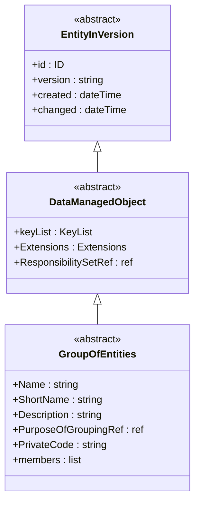
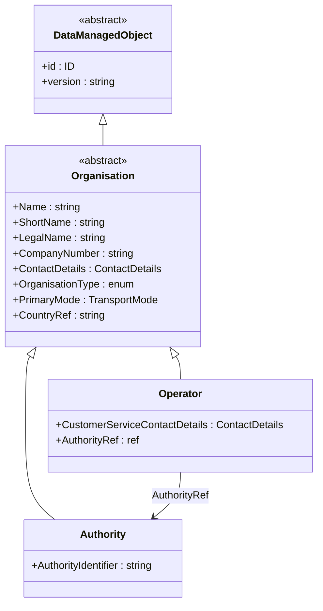
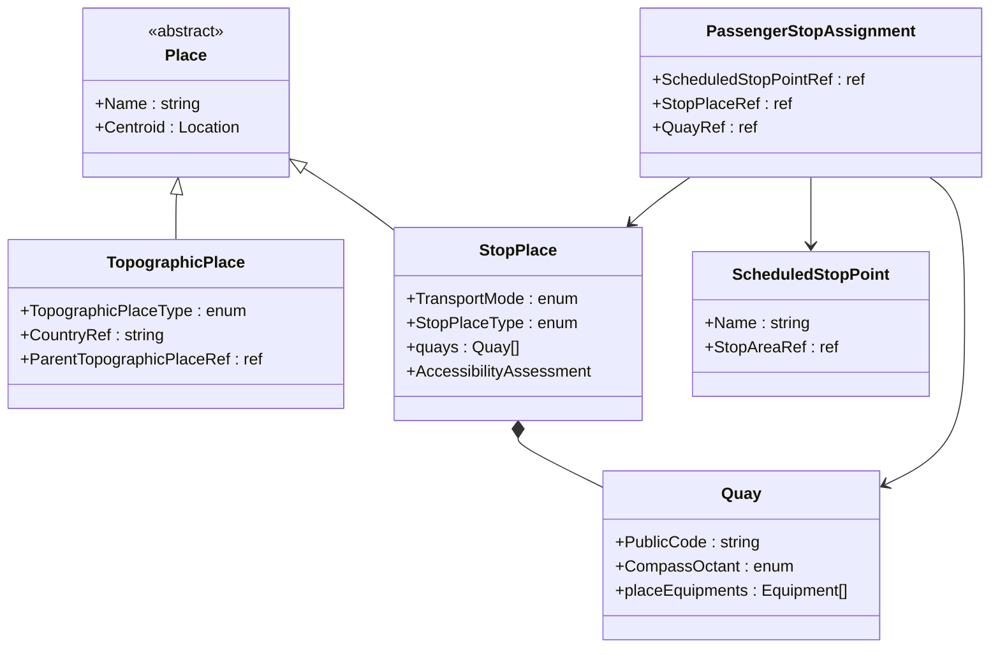
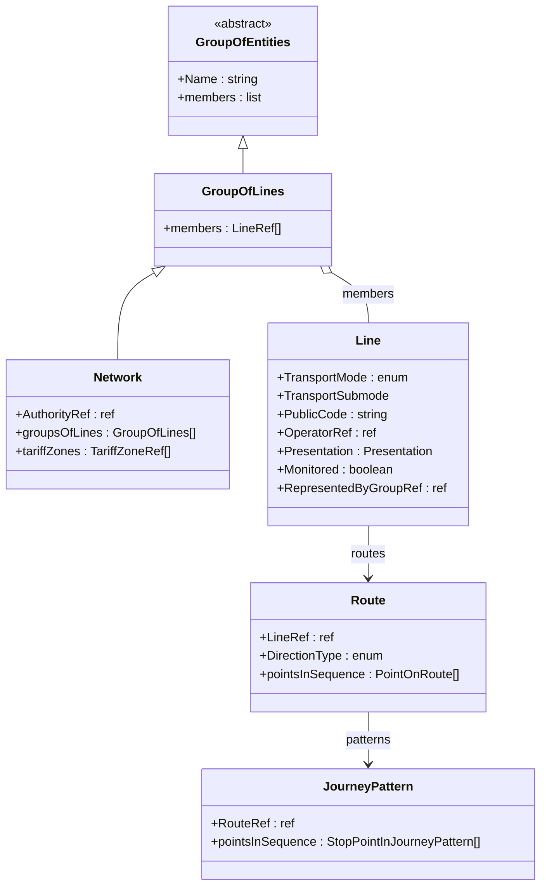
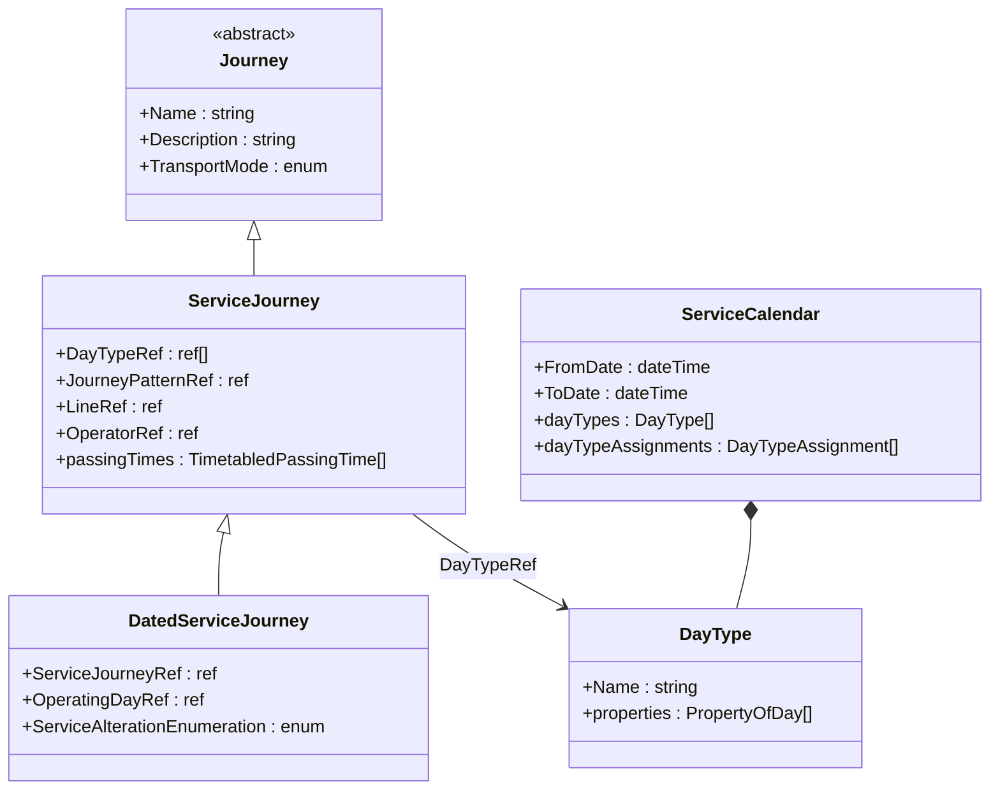
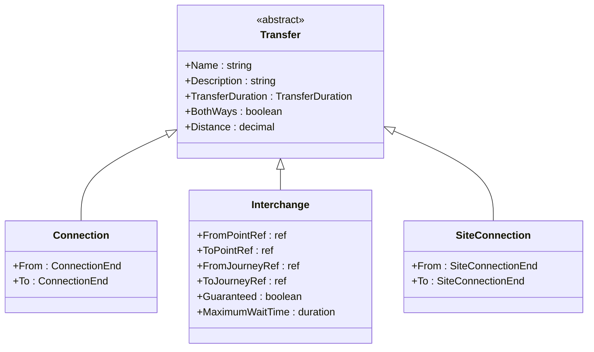
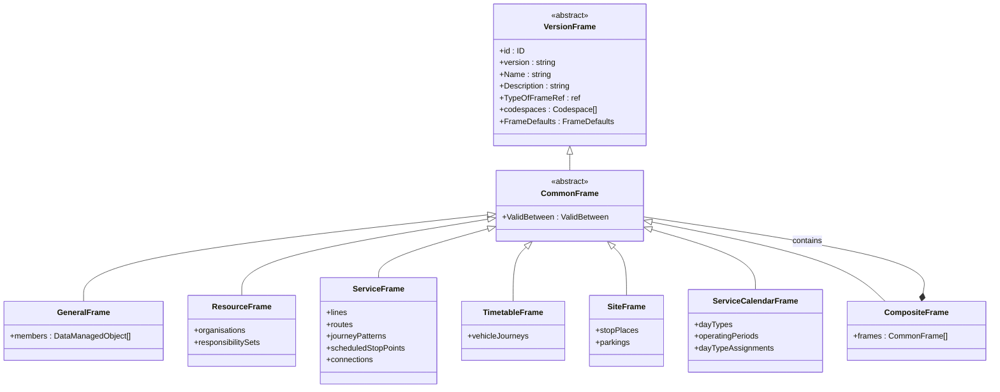

# 🧬 NeTEx Inheritance — Developer Guide

## 1. 🎯 Introduction

NeTEx is built on a deep object-oriented inheritance hierarchy. Understanding this hierarchy is essential for:
- Knowing which elements are **inherited** vs. **specific** to a type
- Understanding why different objects share similar structures (id, version, Name, Description)
- Grasping the relationship between abstract base types and concrete data objects

This guide maps the key inheritance chains in NeTEx using class diagrams, so you can see where each object's properties come from.

> [!TIP]
> You don't need to create entries for abstract types in your data. They exist in the XSD to provide shared structure. Your XML always uses the concrete types (e.g., `Line`, `Operator`, `StopPlace`).

---

## 2. 🏗️ Core Inheritance Chain

Every NeTEx data object inherits from a chain of abstract base types. Here's the fundamental hierarchy:

**What this means in practice:**
- Every object you create (Line, StopPlace, Route, etc.) has `@id` and `@version` — they come from `EntityInVersion`
- `Name`, `ShortName`, `Description` are available on any object that extends `GroupOfEntities`
- You never need to declare these base types — just use the inherited elements directly

---

## 3. 📐 Organisation Hierarchy

Organisations form a simple hierarchy. Both Authority and Operator inherit from Organisation:

> [!NOTE]
> **Authority** governs (plans, contracts) while **Operator** executes (runs the vehicles). An Operator references its contracting Authority. Both share the same Organisation base (Name, ContactDetails, CompanyNumber).

---

## 4. 🚏 Stop Hierarchy

The stop model has two parallel hierarchies — one for infrastructure (physical places), one for planning (logical points):

> [!NOTE]
> **StopPlace/Quay** = physical infrastructure (where is the platform?). **ScheduledStopPoint** = logical stop for planning (where does the journey call?). **PassengerStopAssignment** bridges the two.

---

## 5. 🚌 Line and Route Hierarchy

Lines, routes, and journey patterns form the service structure:

**Reading this diagram:**
- Network extends GroupOfLines (adds AuthorityRef, tariffZones)
- GroupOfLines contains Lines as members
- A Line has Routes; a Route has JourneyPatterns
- This is the chain: **Network → GroupOfLines → Line → Route → JourneyPattern**

---

## 6. 🕐 Journey and Calendar Hierarchy

ServiceJourneys link patterns to timetables:

---

## 7. 🔗 Transfer Hierarchy

Transfers model how passengers move between services:

> [!NOTE]
> **Connection** = spatial transfer between ScheduledStopPoints (schedule-independent). **Interchange** = timed transfer between specific ServiceJourneys. **SiteConnection** = physical link between StopPlaces/Quays.

---

## 8. 📋 Frame Hierarchy

All frames inherit from a common base:

---

## 9. 💡 Why This Matters

Understanding the inheritance model helps you:

| Benefit | Example |
|---------|---------|
| **Avoid redundancy** | Don't document `id`, `version`, `Name` on every object — they're inherited |
| **Predict available elements** | If an object extends `GroupOfEntities`, you know it has `Name`, `Description`, `members` |
| **Map between profiles** | French and Nordic profiles use the same base types — differences are in which concrete types are profiled |
| **Debug validation errors** | An "unexpected element" error often means the element exists on a parent type, not the type you think |

> [!TIP]
> When the XSD says an element is defined on `Transfer_VersionStructure`, that means **Connection**, **Interchange**, and **SiteConnection** all inherit it. You don't need to look up each one separately.
