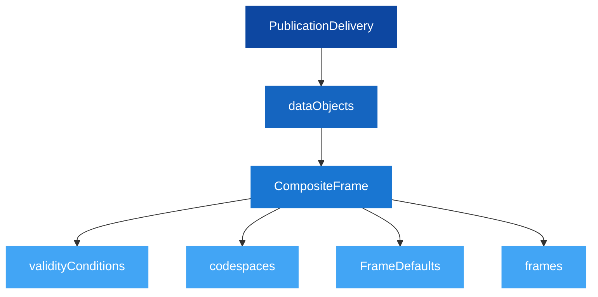
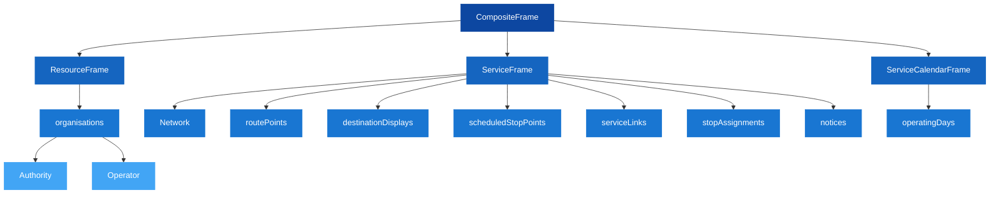
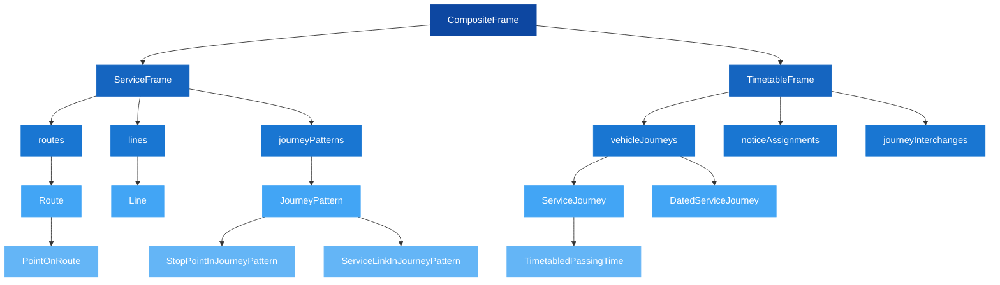
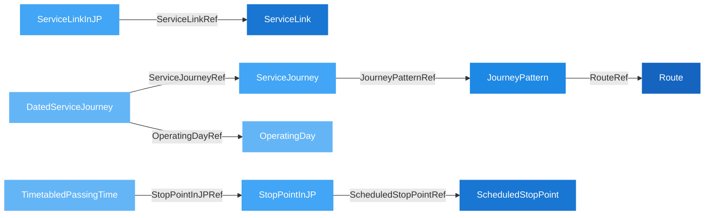

# 🚆 Network Timetable — Developer Guide

## 1. 🎯 Introduction

This guide explains how to produce and consume **network timetable data** using NeTEx, following the European and Nordic NeTEx profiles. It covers the file delivery structure, how objects are split across files, how references link everything together, and the versioning and ID rules you need to get right.

The guide is based on real production data patterns and is aimed at developers building systems that **import, export, or process** NeTEx timetable datasets.

In this guide you will learn:
- 📦 How a timetable dataset is split into shared and line files
- 🏗️ The XML structure inside each file type
- 🔗 How objects reference each other across files
- 🔢 Versioning rules for within-file and cross-file references
- 🏷️ The ID naming convention that ensures global uniqueness

> [!TIP]
> If you're new to NeTEx, start with the [Get Started guide](../GetStarted/GetStarted_Guide.md) first. This guide assumes you understand frames, objects, and the basic document anatomy.

---

## 2. 📦 File Delivery Structure

A complete NeTEx timetable dataset is split into **two types of files**:

| File Type | Purpose | Quantity |
|-----------|---------|----------|
| **Shared data file** (`_shared_data.xml`) | Data reused across all lines: organisations, stop points, route points, destination displays, service links, stop assignments, notices, and the service calendar | **1** per dataset |
| **Line file** (e.g. `Line_100.xml`) | Line-specific data: routes, lines, journey patterns, service journeys, dated service journeys, notice assignments, and journey interchanges | **1 per line** |

This split avoids duplicating shared objects (like stop points and operators) across every line file.

### Consumer Workflow


> [!NOTE]
> Consumers must **load the shared data file first**, then process each line file. Line files reference objects defined in the shared file by their `id`.

---

## 3. 🏗️ XML Structure

Every file — shared or line — follows the same top-level pattern:



For details on the envelope and composite frame, see:
- [CompositeFrame](../../Frames/CompositeFrame/Description_CompositeFrame.md) — frame grouping
- [Codespace](../../Objects/Codespace/Table_Codespace.md) — namespace declarations

---

<!-- tabs:start -->

#### **📄 Shared Data File**

The shared file contains one `CompositeFrame` with three frames:



### Key Objects in the Shared File

| Object | Typical Count | Purpose | Documentation |
|--------|--------------|---------|---------------|
| [Authority](../../Objects/Authority/Table_Authority.md) | 1–5 | Transport authority | [Description](../../Objects/Authority/Description_Authority.md) |
| [Operator](../../Objects/Operator/Table_Operator.md) | 1–5 | Service operator | [Description](../../Objects/Operator/Description_Operator.md) |
| [ScheduledStopPoint](../../Objects/ScheduledStopPoint/Table_ScheduledStopPoint.md) | 100s | Logical stop in timetable | [Description](../../Objects/ScheduledStopPoint/Description_ScheduledStopPoint.md) |
| [DestinationDisplay](../../Objects/DestinationDisplay/Table_DestinationDisplay.md) | 100s | Front-sign text | [Description](../../Objects/DestinationDisplay/Description_DestinationDisplay.md) |
| [PassengerStopAssignment](../../Objects/PassengerStopAssignment/Table_PassengerStopAssignment.md) | 100s | Links logical stop → physical Quay | [Description](../../Objects/PassengerStopAssignment/Description_PassengerStopAssignment.md) |
| [Notice](../../Objects/Notice/Table_Notice.md) | 1–10 | Passenger notices | [Description](../../Objects/Notice/Description_Notice.md) |

> [!TIP]
> The shared file also contains [LinkSequenceProjection](../../Objects/LinkSequenceProjection/Table_LinkSequenceProjection.md) objects inside ServiceLinks — these carry GML coordinates describing the geographic path between stops.

#### **📋 Line File**

Each line file contains one `CompositeFrame` with two frames:



### Key Objects in Line Files

| Object | Typical Count | Purpose | Documentation |
|--------|--------------|---------|---------------|
| [Line](../../Objects/Line/Table_Line.md) | 1 per file | Public line identity | [Description](../../Objects/Line/Description_Line.md) |
| [Route](../../Objects/Route/Table_Route.md) | 1–5 | Ordered stop path | [Description](../../Objects/Route/Description_Route.md) |
| [JourneyPattern](../../Objects/JourneyPattern/Table_JourneyPattern.md) | 10s–100s | Stop sequence variants | [Description](../../Objects/JourneyPattern/Description_JourneyPattern.md) |
| [ServiceJourney](../../Objects/ServiceJourney/Table_ServiceJourney.md) | 100s–1000s | Trip templates with times | [Description](../../Objects/ServiceJourney/Description_ServiceJourney.md) |
| [DatedServiceJourney](../../Objects/DatedServiceJourney/Table_DatedServiceJourney.md) | 1000s–10000s | Concrete daily instances | [Description](../../Objects/DatedServiceJourney/Description_DatedServiceJourney.md) |
| [Interchange](../../Objects/Interchange/Table_Interchange.md) | 0–100s | Planned connections | [Description](../../Objects/Interchange/Description_Interchange.md) |

> [!NOTE]
> `DatedServiceJourney` is the highest-volume object. Each `ServiceJourney` typically generates many dated instances — one per operating day.

<!-- tabs:end -->

---

## 6. 🔗 Reference Linking

Understanding how objects reference each other is critical for consuming NeTEx data. References always use the `ref` attribute pointing to an object's `id`.

### Organisation & Line Ownership


### Route → Stops → Physical Mapping

```mermaid
graph LR
    RT["Route"] -->|LineRef| LN["Line"]
    RT -->|contains| POR["PointOnRoute"]
    POR -->|RoutePointRef| RPT["RoutePoint"]
    RPT -.->|PointProjection| SSP["ScheduledStopPoint"]
    SLK["ServiceLink"] -->|from / to| SSP
    PSA["PassengerStopAssignment"] --> SSP
    PSA --> QY["Quay &#40;external&#41;"]

    style RT fill:#1565C0,stroke:#1565C0,color:#fff
    style LN fill:#1565C0,stroke:#1565C0,color:#fff
    style POR fill:#1976D2,stroke:#1976D2,color:#fff
    style RPT fill:#1976D2,stroke:#1976D2,color:#fff
    style SSP fill:#1976D2,stroke:#1976D2,color:#fff
    style SLK fill:#1976D2,stroke:#1976D2,color:#fff
    style PSA fill:#90CAF9,stroke:#64B5F6,color:#000
    style QY fill:#90CAF9,stroke:#64B5F6,color:#000
```



### Journey Pattern → ServiceJourney → DatedServiceJourney



### Cross-File References

In a shared + line file setup, references cross file boundaries:

| Referencing Object (line file) | Referenced Object (shared file) | Reference Element |
|-------------------------------|--------------------------------|-------------------|
| PointOnRoute | RoutePoint | `RoutePointRef` |
| StopPointInJourneyPattern | ScheduledStopPoint | `ScheduledStopPointRef` |
| StopPointInJourneyPattern | DestinationDisplay | `DestinationDisplayRef` |
| ServiceLinkInJourneyPattern | ServiceLink | `ServiceLinkRef` |
| ServiceJourney | Operator | `OperatorRef` |
| DatedServiceJourney | OperatingDay | `OperatingDayRef` |
| NoticeAssignment | Notice | `NoticeRef` |

> [!TIP]
> Build an in-memory index of all shared objects keyed by `id` when loading the shared file. Then resolve references from line files using simple lookups.

For a deeper look at the journey chain, see the [Journey Lifecycle guide](../JourneyLifecycle/JourneyLifecycle_Guide.md).

---

## 7. 🔢 Versioning Rules

Every NeTEx object carries a `version` attribute. The rules differ depending on whether the reference is local or external:

| Scenario | Version Required? | Example |
|----------|:-----------------:|---------|
| Object defined in the file | ✅ Yes | `<Line version="1" id="VYG:Line:R14">` |
| Reference to object **in the same file** | ✅ Yes | `<LineRef ref="VYG:Line:R14" version="1"/>` |
| Reference to object **in another file** (same dataset) | May omit | `<RoutePointRef ref="VYG:RoutePoint:ASR"/>` |
| Reference to **external system** (e.g. national stop registry) | ❌ Omit | `<QuayRef ref="NSR:Quay:111"/>` |

> [!WARNING]
> The `version` attribute on `PublicationDelivery` specifies the NeTEx **profile version** (e.g. `1.15:NO-NeTEx-networktimetable:1.5`), not the data version. Don't confuse the two.

---

## 8. 🏷️ ID Convention

All IDs follow a three-part pattern ensuring global uniqueness:

```text
<Codespace>:<ObjectType>:<LocalId>
```

**Examples:**
- `VYG:Line:R14` — Line R14 produced by Vy Group
- `VYG:ServiceJourney:1003_348472-R` — A specific service journey
- `NSR:Quay:111` — Quay 111 from the national stop place registry

### Codespace Examples

| Codespace | Description |
|-----------|-------------|
| `ERP` | European Recommended Profile examples |
| `NP` | Nordic Profile |
| `NSR` | National Stop Place Registry (external infrastructure) |

Each codespace is declared in the `codespaces` element of the `CompositeFrame`:

```xml
<codespaces>
  <Codespace id="erp">
    <Xmlns>ERP</Xmlns>
    <XmlnsUrl>http://www.europeanprofile.eu/ns/erp</XmlnsUrl>
  </Codespace>
</codespaces>
```

This convention ensures IDs remain unique when datasets from multiple providers are merged. See [Codespace](../../Objects/Codespace/Table_Codespace.md) and [NeTEx Conventions](../NeTExConventions/NeTEx_Conventions.md) for details.

---

## 9. ✅ Best Practices

> [!TIP]
> - **Load shared data first.** Always parse the shared file before line files. Build an object index keyed by `id` for fast cross-file reference resolution.
> - **Don't assume all optional elements exist.** `noticeAssignments` and `journeyInterchanges` are only present in some line files. Check for their existence before processing.
> - **Handle overnight services.** `TimetabledPassingTime` may include `DepartureDayOffset` or `ArrivalDayOffset` for journeys crossing midnight. A value of `1` means "next day relative to journey start".
> - **First stop = DepartureTime only, last stop = ArrivalTime only.** Intermediate stops have both. See the [Journey Lifecycle guide](../JourneyLifecycle/JourneyLifecycle_Guide.md) for the full pattern.
> - **External references have no version.** When a reference points to an external system (e.g. `NSR:Quay:111` from the national stop place registry), omit the `version` attribute.
> - **Use DestinationDisplay inheritance.** The `DestinationDisplayRef` on a `StopPointInJourneyPattern` applies from that stop onward until overridden by another `DestinationDisplayRef` at a later stop.
> - **DatedServiceJourney is the concrete instance.** Without a `DatedServiceJourney`, a `ServiceJourney` is just a reusable template. The dated version pins it to a specific `OperatingDay`.
> - **Validate against the XSD.** Always validate XML against the NeTEx schema before publishing. See the [Validation guide](../Validation/Validation.md) for tooling.

---

## 10. ❌ Common Mistakes

> [!WARNING]
> - **Processing line files without loading shared data** — Causes unresolved references to stops, operators, and calendar. Always load `_shared_data.xml` first.
> - **Including `version` on external references** — External systems manage their own versions. Omit `version` on `QuayRef`, `StopPlaceRef` etc. from external registries.
> - **Ignoring `DayOffset` on passing times** — Overnight journeys show wrong dates. Add `DepartureDayOffset` / `ArrivalDayOffset` to the journey start date.
> - **Treating `ServiceJourney` as a concrete trip** — It's a template, not an occurrence. Use `DatedServiceJourney` for specific-date instances.
> - **Assuming one Route per Line** — Lines often have forward and return routes. Handle multiple Routes; check `InverseRouteRef`.
> - **Ignoring `ForAlighting` / `ForBoarding`** — Passengers shown incorrect stops. Respect `false` values — first stop typically has `ForAlighting=false`, last has `ForBoarding=false`.

---

## 11. 🔗 Related Resources

### Guides
- [Get Started](../GetStarted/GetStarted_Guide.md) — Foundational NeTEx concepts and document anatomy
- [Journey Lifecycle](../JourneyLifecycle/JourneyLifecycle_Guide.md) — Line → Route → JourneyPattern → ServiceJourney → DatedServiceJourney
- [NeTEx Conventions](../NeTExConventions/NeTEx_Conventions.md) — Casing rules, naming patterns, ID format
- [Organisational Governance](../OrganisationalGovernance/OrganisationalGovernance_Guide.md) — Authority, Operator, and responsibility modelling
- [Stop Infrastructure](../StopInfrastructure/StopInfrastructure_Guide.md) — ScheduledStopPoint, Quay, and the PassengerStopAssignment bridge
- [Calendar](../Calendar/Calendar_Guide.md) — DayType, OperatingPeriod, DayTypeAssignment, OperatingDay — when services operate
- [Passenger Information](../PassengerInformation/PassengerInformation_Guide.md) — DestinationDisplay, Notice, and FlexibleServiceProperties
- [Validation](../Validation/Validation.md) — Schema validation tools and workflows

### Frames
- [CompositeFrame](../../Frames/CompositeFrame/Table_CompositeFrame.md) — Frame grouping and validity
- [ResourceFrame](../../Frames/ResourceFrame/Table_ResourceFrame.md) — Organisations
- [ServiceFrame](../../Frames/ServiceFrame/Table_ServiceFrame.md) — Lines, routes, patterns, stop points
- [ServiceCalendarFrame](../../Frames/ServiceCalendarFrame/Table_ServiceCalendarFrame.md) — Operating days and calendar
- [TimetableFrame](../../Frames/TimetableFrame/Table_TimetableFrame.md) — Journeys and timetables

### Key Objects
- [Line](../../Objects/Line/Table_Line.md) | [Route](../../Objects/Route/Table_Route.md) | [JourneyPattern](../../Objects/JourneyPattern/Table_JourneyPattern.md) | [ServiceJourney](../../Objects/ServiceJourney/Table_ServiceJourney.md) | [DatedServiceJourney](../../Objects/DatedServiceJourney/Table_DatedServiceJourney.md)
- [ScheduledStopPoint](../../Objects/ScheduledStopPoint/Table_ScheduledStopPoint.md) | [PassengerStopAssignment](../../Objects/PassengerStopAssignment/Table_PassengerStopAssignment.md) | [DestinationDisplay](../../Objects/DestinationDisplay/Table_DestinationDisplay.md)
- [Authority](../../Objects/Authority/Table_Authority.md) | [Operator](../../Objects/Operator/Table_Operator.md) | [Codespace](../../Objects/Codespace/Table_Codespace.md)

### External
- [NeTEx CEN Standard](https://www.netex-cen.eu/) — Official specification
- [Transmodel (EN 12896)](https://www.transmodel-cen.eu/) — Conceptual reference model
