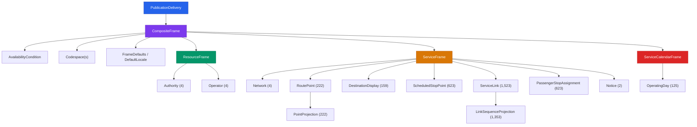
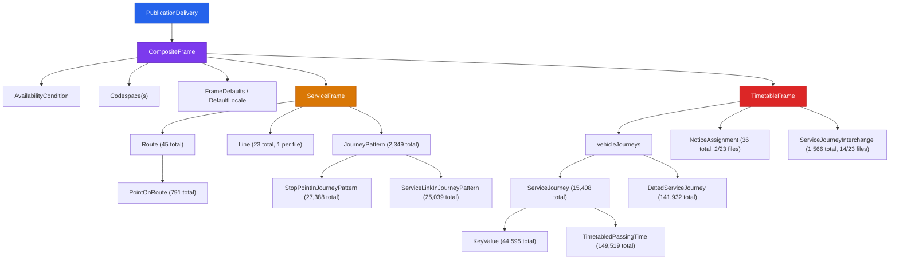

# NeTEx Network Timetable — Developer Guide (Split Edition)

**Based on Vy production data (`rb_vyg-aggregated-netex.zip`) — 1 shared file + 23 line files**

## Table of Contents

- [1. Introduction](#1-introduction)
  - [1.1 File Delivery Structure](#11-file-delivery-structure)
  - [1.2 Overall XML Structure](#12-overall-xml-structure)
  - [1.3 Versioning Rules](#13-versioning-rules)
  - [1.4 ID Convention](#14-id-convention)
- [Part A — Shared Data File](#part-a--shared-data-file)
  - [A.1 Introduction to the Shared Data File](#a1-introduction-to-the-shared-data-file)
  - [A.2 Shared File Structure Diagram](#a2-shared-file-structure-diagram)
  - [A.3 PublicationDelivery (Shared)](#a3-publicationdelivery-shared)
  - [A.4 CompositeFrame (Shared)](#a4-compositeframe-shared)
  - [A.5 AvailabilityCondition](#a5-availabilitycondition)
  - [A.6 Codespace](#a6-codespace)
  - [A.7 FrameDefaults / DefaultLocale](#a7-framedefaults--defaultlocale)
  - [A.8 ResourceFrame](#a8-resourceframe)
  - [A.9 Authority](#a9-authority)
  - [A.10 Operator](#a10-operator)
  - [A.11 ServiceFrame (Shared)](#a11-serviceframe-shared)
  - [A.12 Network](#a12-network)
  - [A.13 RoutePoint](#a13-routepoint)
  - [A.14 PointProjection](#a14-pointprojection)
  - [A.15 DestinationDisplay](#a15-destinationdisplay)
  - [A.16 ScheduledStopPoint](#a16-scheduledstoppoint)
  - [A.17 ServiceLink](#a17-servicelink)
  - [A.18 LinkSequenceProjection](#a18-linksequenceprojection)
  - [A.19 PassengerStopAssignment](#a19-passengerstopassignment)
  - [A.20 Notice](#a20-notice)
  - [A.21 ServiceCalendarFrame](#a21-servicecalendarframe)
  - [A.22 OperatingDay](#a22-operatingday)
  - [A.23 Shared File Object Summary](#a23-shared-file-object-summary)
- [Part B — Line File](#part-b--line-file)
  - [B.1 Introduction to the Line File](#b1-introduction-to-the-line-file)
  - [B.2 Line File Structure Diagram](#b2-line-file-structure-diagram)
  - [B.3 PublicationDelivery (Line)](#b3-publicationdelivery-line)
  - [B.4 CompositeFrame (Line)](#b4-compositeframe-line)
  - [B.5 ServiceFrame (Line)](#b5-serviceframe-line)
  - [B.6 Route](#b6-route)
  - [B.7 PointOnRoute](#b7-pointonroute)
  - [B.8 Line](#b8-line)
  - [B.9 JourneyPattern](#b9-journeypattern)
  - [B.10 StopPointInJourneyPattern](#b10-stoppointinjourneypattern)
  - [B.11 ServiceLinkInJourneyPattern](#b11-servicelinkinjourneypattern)
  - [B.12 TimetableFrame](#b12-timetableframe)
  - [B.13 ServiceJourney](#b13-servicejourney)
  - [B.14 KeyValue](#b14-keyvalue)
  - [B.15 TimetabledPassingTime](#b15-timetabledpassingtime)
  - [B.16 DatedServiceJourney](#b16-datedservicejourney)
  - [B.17 NoticeAssignment](#b17-noticeassignment)
  - [B.18 ServiceJourneyInterchange](#b18-servicejourneyinterchange)
  - [B.19 Line File Object Summary](#b19-line-file-object-summary)
- [Appendix: Reference Linking Guide](#appendix-reference-linking-guide)

---

## 1. Introduction

This guide describes how to produce and consume timetable data using the NeTEx (Network Timetable Exchange) standard, following the Norwegian NeTEx profile (`NO-NeTEx-networktimetable`). The data is delivered as XML files wrapped in a `PublicationDelivery` envelope.

The guide is split into two parts:

- **Part A** covers the **shared data file** — the single file containing objects reused across all lines.
- **Part B** covers the **line file** — produced once per line, containing routes, timetables, and journeys.

### 1.1 File Delivery Structure

A complete NeTEx dataset is split into **two types of files**:

| File | Purpose | Quantity |
|------|---------|----------|
| **Shared data file** (`_shared_data.xml`) | Contains data reused across all lines: organisations, stop points, route points, destination displays, service links, stop assignments, notices, and the service calendar. | **1** per dataset |
| **Line file** (e.g. `Line_R14.xml`, `Line_F4.xml`) | Contains line-specific data: routes, lines, journey patterns, service journeys, dated service journeys, notice assignments, and journey interchanges. | **1 per line** (23 in Vy production data) |

This split avoids duplicating shared objects (like stop points and operators) across every line file. Consumers should **load the shared data file first**, then process each line file. Line files reference objects defined in the shared file by their `id` (and optionally `version`).

### 1.2 Overall XML Structure

Every file — shared or line — follows the same envelope structure:

```
PublicationDelivery
└── CompositeFrame
    ├── validityConditions → AvailabilityCondition
    ├── codespaces → Codespace(s)
    ├── FrameDefaults → DefaultLocale
    └── frames
        ├── ResourceFrame        (shared file only)
        ├── ServiceFrame          (both — different contents)
        ├── ServiceCalendarFrame  (shared file only)
        └── TimetableFrame        (line files only)
```

### 1.3 Versioning Rules

- Every object defined within the same XML file **must** include a `version` attribute.
- References to objects **within the same file** must include matching `version` attributes.
- References to **external objects** (e.g. `NSR:Quay:111` from the national stop place registry) must **omit** the `version` attribute.
- References to objects in the **shared file** from a **line file** may omit the version when the referenced object is external to the line file's scope.
- The `version` attribute on `PublicationDelivery` specifies the NeTEx profile version, not the data version.

### 1.4 ID Convention

All IDs follow the pattern:

```
<Codespace>:<ObjectType>:<LocalId>
```

For example: `VYG:Line:R14`, `VYG:ServiceJourney:1003_348472-R`, `NSR:Quay:111`.

This ensures global uniqueness when datasets from multiple providers are merged.

The Vy dataset uses the following codespaces:

| Codespace | Description |
|-----------|-------------|
| `VYG` | Vy Group — main codespace for all Vy-produced objects |
| `PEN` | Entur platform references |
| `NSR` | National Stop Place Registry — external quay/stop references |

---

---

# Part A — Shared Data File

---

## A.1 Introduction to the Shared Data File

The shared data file (`_shared_data.xml`) is the foundation of a NeTEx dataset. It contains **all objects that are reused across multiple lines** and must be loaded before any line file can be processed.

Think of it as the "dictionary" that line files reference. When a line file says a journey stops at `VYG:ScheduledStopPoint:ASR-2`, the consumer looks up that stop point in the shared file to get its name. When a line file references `VYG:Operator:VY`, the consumer finds the operator details (name, contact info) in the shared file.

**The shared file contains three frames:**

| Frame | Purpose | Key Objects |
|-------|---------|-------------|
| **ResourceFrame** | Organisational data | 4 Authorities, 4 Operators |
| **ServiceFrame** | Network topology and stop infrastructure | 4 Networks, 222 RoutePoints, 159 DestinationDisplays, 623 ScheduledStopPoints, 1,523 ServiceLinks, 623 PassengerStopAssignments, 2 Notices |
| **ServiceCalendarFrame** | Calendar of operating days | 125 OperatingDays |

**Why a separate shared file?** Without it, each of the 23 line files would need to duplicate the 623 stop points, 1,523 service links, and all other common objects. The shared file eliminates this redundancy and ensures consistency — a stop name is defined once and referenced everywhere.

**Processing order:** Always parse the shared file first. Build lookup maps (by `id`) for all shared objects so they can be resolved when processing line files.

## A.2 Shared File Structure Diagram



---

## A.3 PublicationDelivery (Shared)

The root envelope for the shared data file. Identical structure to the line file envelope, but with a description indicating shared data.

| Field | Data Type | Mandatory | Description |
|-------|-----------|-----------|-------------|
| `@version` | `string` (attribute) | Yes | NeTEx profile version, e.g. `1.15:NO-NeTEx-networktimetable:1.5` |
| `PublicationTimestamp` | `xsd:dateTime` | Yes | Timestamp when this dataset was generated |
| `ParticipantRef` | `string` | Yes | Identifier of the data provider (e.g. `RB`) |
| `Description` | `string` | Yes | Should indicate this is shared data (e.g. `Shared data used across line files`) |
| `dataObjects` | container | Yes | Contains one `CompositeFrame` |

```xml
<PublicationDelivery xmlns="http://www.netex.org.uk/netex"
                     version="1.15:NO-NeTEx-networktimetable:1.5">
  <PublicationTimestamp>2025-12-02T09:24:59.781</PublicationTimestamp>
  <ParticipantRef>RB</ParticipantRef>
  <Description>Shared data used across line files</Description>
  <dataObjects>
    <!-- One CompositeFrame -->
  </dataObjects>
</PublicationDelivery>
```

---

## A.4 CompositeFrame (Shared)

Groups the three shared frames under a common validity period.

| Field | Data Type | Mandatory | Description |
|-------|-----------|-----------|-------------|
| `@id` | `string` (attribute) | Yes | Unique identifier |
| `@version` | `string` (attribute) | Yes | Version |
| `@created` | `xsd:dateTime` (attribute) | Yes | Creation timestamp |
| `validityConditions` | container | Yes | Contains one `AvailabilityCondition` |
| `codespaces` | container | Yes | Contains `Codespace` elements |
| `FrameDefaults` | element | Yes | Default locale settings |
| `frames` | container | Yes | Contains `ResourceFrame`, `ServiceFrame`, and `ServiceCalendarFrame` |

```xml
<CompositeFrame created="2025-12-02T09:21:44.325" version="1"
                id="VYG:CompositeFrame:18310411">
  <validityConditions>
    <AvailabilityCondition version="1" id="VYG:AvailabilityCondition:18310407">
      <FromDate>2025-11-30T00:00:00</FromDate>
      <ToDate>2026-12-02T00:00:00</ToDate>
    </AvailabilityCondition>
  </validityConditions>
  <codespaces><!-- ... --></codespaces>
  <FrameDefaults><!-- ... --></FrameDefaults>
  <frames>
    <ResourceFrame ...><!-- ... --></ResourceFrame>
    <ServiceFrame ...><!-- ... --></ServiceFrame>
    <ServiceCalendarFrame ...><!-- ... --></ServiceCalendarFrame>
  </frames>
</CompositeFrame>
```

---

## A.5 AvailabilityCondition

Defines the time period during which the entire dataset is valid. All objects in the `CompositeFrame` inherit this validity.

| Field | Data Type | Mandatory | Description |
|-------|-----------|-----------|-------------|
| `@id` | `string` (attribute) | Yes | Unique identifier |
| `@version` | `string` (attribute) | Yes | Version |
| `FromDate` | `xsd:dateTime` | Yes | Start of validity period (inclusive) |
| `ToDate` | `xsd:dateTime` | Optional | End of validity period (exclusive) |

```xml
<AvailabilityCondition version="1" id="VYG:AvailabilityCondition:18310407">
  <FromDate>2025-11-30T00:00:00</FromDate>
  <ToDate>2026-12-02T00:00:00</ToDate>
</AvailabilityCondition>
```

---

## A.6 Codespace

Ensures that object IDs remain unique when data from multiple providers is combined.

| Field | Data Type | Mandatory | Description |
|-------|-----------|-----------|-------------|
| `@id` | `string` (attribute) | Yes | Internal identifier |
| `Xmlns` | `string` | Yes | Short prefix used in object IDs (e.g. `VYG`, `PEN`, `NSR`) |
| `XmlnsUrl` | `anyURI` | Yes | Namespace URL |

```xml
<Codespace id="vyg">
  <Xmlns>VYG</Xmlns>
  <XmlnsUrl>http://www.rutebanken.org/ns/vyg</XmlnsUrl>
</Codespace>
```

---

## A.7 FrameDefaults / DefaultLocale

Default values inherited by all objects in the frame.

| Field | Data Type | Mandatory | Description |
|-------|-----------|-----------|-------------|
| `TimeZone` | `string` | Yes | IANA timezone (e.g. `Europe/Oslo`) |
| `DefaultLanguage` | `string` | Yes | ISO 639-1 language code (e.g. `no`) |

```xml
<FrameDefaults>
  <DefaultLocale>
    <TimeZone>Europe/Oslo</TimeZone>
    <DefaultLanguage>no</DefaultLanguage>
  </DefaultLocale>
</FrameDefaults>
```

---

## A.8 ResourceFrame

*(1 instance)*

Contains organisational data — the authorities and operators referenced by networks and lines.

| Field | Data Type | Mandatory | Description |
|-------|-----------|-----------|-------------|
| `@id` | `string` (attribute) | Yes | Unique identifier |
| `@version` | `string` (attribute) | Yes | Version |
| `organisations` | container | Yes | Contains `Authority` and `Operator` elements |

```xml
<ResourceFrame version="1" id="VYG:ResourceFrame:18310412">
  <organisations>
    <Authority version="1" id="VYG:Authority:VY"><!-- ... --></Authority>
    <Authority version="1" id="VYG:Authority:VYT"><!-- ... --></Authority>
    <Operator version="1" id="VYG:Operator:VY"><!-- ... --></Operator>
    <Operator version="1" id="VYG:Operator:FLB"><!-- ... --></Operator>
  </organisations>
</ResourceFrame>
```

---

## A.9 Authority

*(4 instances)*

An organisation responsible for managing or contracting public transport services.

| Field | Data Type | Mandatory | Description |
|-------|-----------|-----------|-------------|
| `@id` | `string` (attribute) | Yes | Unique identifier (e.g. `VYG:Authority:VY`) |
| `@version` | `string` (attribute) | Yes | Version |
| `Name` | `string` | Yes | Display name |
| `ContactDetails` | element | Optional | Contains `Phone` and/or `Url` |
| `OrganisationType` | `enum` | Yes | Must be `authority` |

```xml
<Authority version="1" id="VYG:Authority:VY">
  <Name>Vy</Name>
  <ContactDetails>
    <Phone>+47 61 05 19 10</Phone>
    <Url>https://www.vy.no/</Url>
  </ContactDetails>
  <OrganisationType>authority</OrganisationType>
</Authority>
```

---

## A.10 Operator

*(4 instances)*

An organisation that actually runs transport services.

| Field | Data Type | Mandatory | Description |
|-------|-----------|-----------|-------------|
| `@id` | `string` (attribute) | Yes | Unique identifier (e.g. `VYG:Operator:VY`) |
| `@version` | `string` (attribute) | Yes | Version |
| `Name` | `string` | Yes | Display name |
| `OrganisationType` | `enum` | Yes | Must be `operator` |
| `CustomerServiceContactDetails` | element | Optional | Contains `Email`, `Phone`, and/or `Url` |

```xml
<Operator version="1" id="VYG:Operator:VY">
  <Name>VY</Name>
  <OrganisationType>operator</OrganisationType>
  <CustomerServiceContactDetails>
    <Email>support@vy.no</Email>
    <Phone>+47 61 05 19 10</Phone>
    <Url>https://www.vy.no/</Url>
  </CustomerServiceContactDetails>
</Operator>
```

---

## A.11 ServiceFrame (Shared)

*(1 instance in shared file)*

In the shared file, the `ServiceFrame` contains all the network topology and stop infrastructure: networks, route points, destination displays, stop points, service links, stop assignments, and notices.

| Field | Data Type | Mandatory | Description |
|-------|-----------|-----------|-------------|
| `@id` | `string` (attribute) | Yes | Unique identifier |
| `@version` | `string` (attribute) | Yes | Version |
| `Network` | element | Yes | Primary network |
| `additionalNetworks` | container | Optional | Additional networks |
| `routePoints` | container | Yes | 222 `RoutePoint` elements |
| `destinationDisplays` | container | Yes | 159 `DestinationDisplay` elements |
| `scheduledStopPoints` | container | Yes | 623 `ScheduledStopPoint` elements |
| `serviceLinks` | container | Yes | 1,523 `ServiceLink` elements |
| `stopAssignments` | container | Yes | 623 `PassengerStopAssignment` elements |
| `notices` | container | Optional | 2 `Notice` elements |

```xml
<ServiceFrame version="1" id="VYG:ServiceFrame:18310413">
  <Network version="0" id="VYG:Network:TAG"><!-- ... --></Network>
  <additionalNetworks><!-- ... --></additionalNetworks>
  <routePoints><!-- 222 RoutePoint elements --></routePoints>
  <destinationDisplays><!-- 159 DestinationDisplay elements --></destinationDisplays>
  <scheduledStopPoints><!-- 623 ScheduledStopPoint elements --></scheduledStopPoints>
  <serviceLinks><!-- 1,523 ServiceLink elements --></serviceLinks>
  <stopAssignments><!-- 623 PassengerStopAssignment elements --></stopAssignments>
  <notices><!-- 2 Notice elements --></notices>
</ServiceFrame>
```

---

## A.12 Network

*(4 instances)*

A grouping of lines under a brand or authority.

| Field | Data Type | Mandatory | Description |
|-------|-----------|-----------|-------------|
| `@id` | `string` (attribute) | Yes | Unique identifier |
| `@version` | `string` (attribute) | Yes | Version |
| `Name` | `string` | Yes | Display name |
| `AuthorityRef` | reference | Yes | Reference to the managing `Authority` |

```xml
<Network version="0" id="VYG:Network:VY">
  <Name>VY</Name>
  <AuthorityRef ref="VYG:Authority:VY" version="1" />
</Network>
```

---

## A.13 RoutePoint

*(222 instances)*

A point along a route, projected onto a `ScheduledStopPoint` via a `PointProjection`. Referenced by `PointOnRoute` in line files.

| Field | Data Type | Mandatory | Description |
|-------|-----------|-----------|-------------|
| `@id` | `string` (attribute) | Yes | Unique identifier (e.g. `VYG:RoutePoint:NTH`) |
| `@version` | `string` (attribute) | Yes | Version |
| `Name` | `string` | Optional | Human-readable name |
| `projections` | container | Yes | Contains a `PointProjection` |

```xml
<RoutePoint version="1" id="VYG:RoutePoint:NTH">
  <Name>Nationaltheatret</Name>
  <projections>
    <PointProjection version="1" id="VYG:PointProjection:18278550">
      <ProjectedPointRef ref="VYG:ScheduledStopPoint:NTH-4" version="1" />
    </PointProjection>
  </projections>
</RoutePoint>
```

---

## A.14 PointProjection

*(222 instances)*

Links a `RoutePoint` to a `ScheduledStopPoint`.

| Field | Data Type | Mandatory | Description |
|-------|-----------|-----------|-------------|
| `@id` | `string` (attribute) | Yes | Unique identifier |
| `@version` | `string` (attribute) | Yes | Version |
| `ProjectedPointRef` | reference | Yes | Reference to the `ScheduledStopPoint` |

```xml
<PointProjection version="1" id="VYG:PointProjection:18278550">
  <ProjectedPointRef ref="VYG:ScheduledStopPoint:NTH-4" version="1" />
</PointProjection>
```

---

## A.15 DestinationDisplay

*(159 instances)*

The text shown on vehicle displays indicating the final destination.

| Field | Data Type | Mandatory | Description |
|-------|-----------|-----------|-------------|
| `@id` | `string` (attribute) | Yes | Unique identifier |
| `@version` | `string` (attribute) | Yes | Version |
| `FrontText` | `string` | Yes | Destination text (e.g. `Kongsvinger`, `Bergen`) |

```xml
<DestinationDisplay version="1" id="VYG:DestinationDisplay:R14-38_Kongsvinger">
  <FrontText>Kongsvinger</FrontText>
</DestinationDisplay>
```

---

## A.16 ScheduledStopPoint

*(623 instances)*

A logical point in the timetable where a vehicle is scheduled to stop. The physical quay is linked via `PassengerStopAssignment`.

| Field | Data Type | Mandatory | Description |
|-------|-----------|-----------|-------------|
| `@id` | `string` (attribute) | Yes | Unique identifier (e.g. `VYG:ScheduledStopPoint:ASR-2`) |
| `@version` | `string` (attribute) | Yes | Version |
| `Name` | `string` | Yes | Human-readable name |

```xml
<ScheduledStopPoint version="1" id="VYG:ScheduledStopPoint:HEI-1">
  <Name>Heia</Name>
</ScheduledStopPoint>
```

---

## A.17 ServiceLink

*(1,523 instances)*

The physical path between two consecutive `ScheduledStopPoint`s, with distance and optional geographic projection.

| Field | Data Type | Mandatory | Description |
|-------|-----------|-----------|-------------|
| `@id` | `string` (attribute) | Yes | Unique identifier |
| `@version` | `string` (attribute) | Yes | Version |
| `Distance` | `decimal` | Optional | Distance in metres |
| `projections` | container | Optional | Contains a `LinkSequenceProjection` (present in 1,353 of 1,523 instances) |
| `FromPointRef` | reference | Yes | Departure `ScheduledStopPoint` |
| `ToPointRef` | reference | Yes | Arrival `ScheduledStopPoint` |

```xml
<ServiceLink version="1" id="VYG:ServiceLink:LU-1_GRA-1_-1128026429">
  <Distance>7699.853253</Distance>
  <projections>
    <LinkSequenceProjection version="1" id="VYG:LinkSequenceProjection:18285403">
      <gml:LineString srsName="4326" srsDimension="2" gml:id="LS_1700918">
        <gml:posList count="788" srsDimension="2">60.30479 10.58477 ...</gml:posList>
      </gml:LineString>
    </LinkSequenceProjection>
  </projections>
  <FromPointRef ref="VYG:ScheduledStopPoint:LU-1" version="1" />
  <ToPointRef ref="VYG:ScheduledStopPoint:GRA-1" version="1" />
</ServiceLink>
```

---

## A.18 LinkSequenceProjection

*(1,353 instances)*

Geographic projection of a `ServiceLink` as a GML `LineString`. Not all service links have projections (1,353 of 1,523 do).

| Field | Data Type | Mandatory | Description |
|-------|-----------|-----------|-------------|
| `@id` | `string` (attribute) | Yes | Unique identifier |
| `@version` | `string` (attribute) | Yes | Version |
| `gml:LineString` | element | Yes | GML geometry with `posList` in WGS84 (EPSG:4326) |

```xml
<LinkSequenceProjection version="1" id="VYG:LinkSequenceProjection:18285403">
  <gml:LineString srsName="4326" srsDimension="2" gml:id="LS_1700918">
    <gml:posList count="788" srsDimension="2">60.30479 10.58477 60.30503 10.58475 ...</gml:posList>
  </gml:LineString>
</LinkSequenceProjection>
```

---

## A.19 PassengerStopAssignment

*(623 instances — one per ScheduledStopPoint)*

Links a logical `ScheduledStopPoint` to a physical `Quay` in the national stop place registry.

| Field | Data Type | Mandatory | Description |
|-------|-----------|-----------|-------------|
| `@id` | `string` (attribute) | Yes | Unique identifier |
| `@version` | `string` (attribute) | Yes | Version |
| `@order` | `integer` (attribute) | Yes | Sort order |
| `ScheduledStopPointRef` | reference | Yes | Reference to the `ScheduledStopPoint` |
| `QuayRef` | reference | Yes | Reference to the physical quay (external NSR ID — **no version attribute**) |

```xml
<PassengerStopAssignment order="380" version="1"
                         id="VYG:PassengerStopAssignment:HAL-1">
  <ScheduledStopPointRef ref="VYG:ScheduledStopPoint:HAL-1" version="1" />
  <QuayRef ref="NSR:Quay:111" />
</PassengerStopAssignment>
```

> **Note:** `QuayRef` points to an external system (NSR) and must **not** include a `version` attribute.

---

## A.20 Notice

*(2 instances)*

A textual notice that can be attached to service journeys via `NoticeAssignment` in line files.

| Field | Data Type | Mandatory | Description |
|-------|-----------|-----------|-------------|
| `@id` | `string` (attribute) | Yes | Unique identifier |
| `@version` | `string` (attribute) | Yes | Version |
| `Text` | `string` | Yes | Notice text (may contain multiple languages separated by `/`) |

```xml
<Notice version="1" id="VYG:Notice:332">
  <Text>Toget har ikke kafé, lekerom eller sykkelplasser. Husk å ta med mat og drikke.
  De fleste setene har ikke bord. / This train does not have a café, playroom,
  or space for bicycles. Please bring food and drink. Most seats do not have tables</Text>
</Notice>
```

---

## A.21 ServiceCalendarFrame

*(1 instance)*

Contains the calendar of operating days referenced by `DatedServiceJourney` in line files.

| Field | Data Type | Mandatory | Description |
|-------|-----------|-----------|-------------|
| `@id` | `string` (attribute) | Yes | Unique identifier |
| `@version` | `string` (attribute) | Yes | Version |
| `operatingDays` | container | Yes | Contains `OperatingDay` elements |

```xml
<ServiceCalendarFrame version="1" id="VYG:ServiceCalendarFrame:18310414">
  <operatingDays>
    <OperatingDay version="1" id="VYG:OperatingDay:2026-01-30">
      <CalendarDate>2026-01-30</CalendarDate>
    </OperatingDay>
    <!-- 124 more OperatingDay elements -->
  </operatingDays>
</ServiceCalendarFrame>
```

---

## A.22 OperatingDay

*(125 instances)*

A specific calendar date on which service journeys operate.

| Field | Data Type | Mandatory | Description |
|-------|-----------|-----------|-------------|
| `@id` | `string` (attribute) | Yes | Unique identifier (convention: `VYG:OperatingDay:YYYY-MM-DD`) |
| `@version` | `string` (attribute) | Yes | Version |
| `CalendarDate` | `xsd:date` | Yes | The date (e.g. `2026-01-30`) |

```xml
<OperatingDay version="1" id="VYG:OperatingDay:2026-01-30">
  <CalendarDate>2026-01-30</CalendarDate>
</OperatingDay>
```

---

## A.23 Shared File Object Summary

| Object | Count | Frame |
|--------|------:|-------|
| Authority | 4 | ResourceFrame |
| Operator | 4 | ResourceFrame |
| Network | 4 | ServiceFrame |
| RoutePoint | 222 | ServiceFrame |
| PointProjection | 222 | ServiceFrame |
| DestinationDisplay | 159 | ServiceFrame |
| ScheduledStopPoint | 623 | ServiceFrame |
| ServiceLink | 1,523 | ServiceFrame |
| LinkSequenceProjection | 1,353 | ServiceFrame |
| PassengerStopAssignment | 623 | ServiceFrame |
| Notice | 2 | ServiceFrame |
| OperatingDay | 125 | ServiceCalendarFrame |

---

---

# Part B — Line File

---

## B.1 Introduction to the Line File

Each line file contains the **complete timetable for a single line**. There is exactly one line file per public transport line — the Vy production dataset contains 23 line files for 23 lines.

A line file defines the routes a line takes, the stopping patterns (journey patterns), the individual trips (service journeys) with their times, and which dates each trip operates on (dated service journeys). It also contains optional interchange and notice data.

**Line files depend on the shared file.** Nearly every object in a line file references something from the shared file: stop points, route points, destination displays, service links, operators, and operating days. A consumer that processes a line file without first loading the shared data will encounter unresolvable references.

**The line file contains two frames:**

| Frame | Purpose | Key Objects |
|-------|---------|-------------|
| **ServiceFrame** | Line-specific topology | Routes, Lines, JourneyPatterns (with StopPointInJourneyPattern and ServiceLinkInJourneyPattern) |
| **TimetableFrame** | Actual timetable | ServiceJourneys (with TimetabledPassingTimes and KeyValues), DatedServiceJourneys, NoticeAssignments, ServiceJourneyInterchanges |

**Key relationships in a line file:**

1. A **Line** belongs to a `Network` and is run by an `Operator` (both from shared file).
2. A **Route** describes the ordered path the line takes, referencing `RoutePoint`s from the shared file.
3. A **JourneyPattern** defines which stops a vehicle visits along a route, referencing `ScheduledStopPoint`s and `ServiceLink`s from the shared file.
4. A **ServiceJourney** is a trip at specific times, following a journey pattern.
5. A **DatedServiceJourney** says "this trip runs on this date", linking to `OperatingDay`s from the shared file.

**Volume:** Line files are where the bulk of the data lives. The 23 line files together contain 15,408 service journeys, 149,519 passing times, and 141,932 dated service journeys.

## B.2 Line File Structure Diagram



---

## B.3 PublicationDelivery (Line)

The root envelope for a line file. The `Description` indicates which line the file covers.

| Field | Data Type | Mandatory | Description |
|-------|-----------|-----------|-------------|
| `@version` | `string` (attribute) | Yes | NeTEx profile version |
| `PublicationTimestamp` | `xsd:dateTime` | Yes | Generation timestamp |
| `ParticipantRef` | `string` | Yes | Data provider identifier |
| `Description` | `string` | Yes | Line name (e.g. `Asker-Oslo S-Kongsvinger`, `Oslo S-Bergen`) |
| `dataObjects` | container | Yes | Contains one `CompositeFrame` |

```xml
<PublicationDelivery xmlns="http://www.netex.org.uk/netex"
                     version="1.15:NO-NeTEx-networktimetable:1.5">
  <PublicationTimestamp>2025-12-02T09:24:58.543</PublicationTimestamp>
  <ParticipantRef>RB</ParticipantRef>
  <Description>Asker-Oslo S-Kongsvinger</Description>
  <dataObjects>
    <!-- One CompositeFrame -->
  </dataObjects>
</PublicationDelivery>
```

---

## B.4 CompositeFrame (Line)

Groups the two line-specific frames under a common validity period.

| Field | Data Type | Mandatory | Description |
|-------|-----------|-----------|-------------|
| `@id` | `string` (attribute) | Yes | Unique identifier |
| `@version` | `string` (attribute) | Yes | Version |
| `@created` | `xsd:dateTime` (attribute) | Yes | Creation timestamp |
| `validityConditions` | container | Yes | Contains one `AvailabilityCondition` |
| `codespaces` | container | Yes | Contains `Codespace` elements |
| `FrameDefaults` | element | Yes | Default locale settings |
| `frames` | container | Yes | Contains `ServiceFrame` and `TimetableFrame` |

```xml
<CompositeFrame created="2025-12-02T09:21:44.325" version="1"
                id="VYG:CompositeFrame:18309356">
  <validityConditions><!-- ... --></validityConditions>
  <codespaces><!-- ... --></codespaces>
  <FrameDefaults><!-- ... --></FrameDefaults>
  <frames>
    <ServiceFrame ...><!-- routes, lines, journeyPatterns --></ServiceFrame>
    <TimetableFrame ...><!-- vehicleJourneys, interchanges --></TimetableFrame>
  </frames>
</CompositeFrame>
```

---

## B.5 ServiceFrame (Line)

*(23 instances — one per line file)*

In a line file, the `ServiceFrame` contains the line definition, its routes, and journey patterns.

| Field | Data Type | Mandatory | Description |
|-------|-----------|-----------|-------------|
| `@id` | `string` (attribute) | Yes | Unique identifier |
| `@version` | `string` (attribute) | Yes | Version |
| `routes` | container | Yes | Contains `Route` elements |
| `lines` | container | Yes | Contains exactly one `Line` element |
| `journeyPatterns` | container | Yes | Contains `JourneyPattern` elements |

```xml
<ServiceFrame version="1" id="VYG:ServiceFrame:18309357">
  <routes>
    <Route version="0" id="VYG:Route:R14-F"><!-- ... --></Route>
    <Route version="0" id="VYG:Route:R14-R"><!-- ... --></Route>
  </routes>
  <lines>
    <Line version="0" id="VYG:Line:R14"><!-- ... --></Line>
  </lines>
  <journeyPatterns>
    <JourneyPattern version="0" id="VYG:JourneyPattern:R14-900"><!-- ... --></JourneyPattern>
    <!-- more JourneyPattern elements -->
  </journeyPatterns>
</ServiceFrame>
```

---

## B.6 Route

*(45 instances across all line files)*

An ordered sequence of `RoutePoint`s describing the path of a line in one direction. Most lines have two routes (forward and reverse), producing 45 routes for 23 lines.

| Field | Data Type | Mandatory | Description |
|-------|-----------|-----------|-------------|
| `@id` | `string` (attribute) | Yes | Unique identifier |
| `@version` | `string` (attribute) | Yes | Version |
| `Name` | `string` | Yes | Route name (e.g. `ASR - KVG`) |
| `ShortName` | `string` | Yes | Abbreviated name (e.g. `ASR-KVG`) |
| `LineRef` | reference | Yes | Reference to the `Line` |
| `pointsInSequence` | container | Yes | Ordered `PointOnRoute` elements |
| `InverseRouteRef` | reference | Optional | Reference to the opposite-direction route |

```xml
<Route version="0" id="VYG:Route:R14-F">
  <Name>ASR - KVG</Name>
  <ShortName>ASR-KVG</ShortName>
  <LineRef ref="VYG:Line:R14" version="0" />
  <pointsInSequence>
    <PointOnRoute order="1" version="1" id="VYG:PointOnRoute:18308245">
      <RoutePointRef ref="VYG:RoutePoint:ASR" />
    </PointOnRoute>
    <PointOnRoute order="2" version="1" id="VYG:PointOnRoute:18308246">
      <RoutePointRef ref="VYG:RoutePoint:SV" />
    </PointOnRoute>
    <!-- more stops -->
  </pointsInSequence>
  <InverseRouteRef ref="VYG:Route:R14-R" version="0" />
</Route>
```

---

## B.7 PointOnRoute

*(791 instances across all line files)*

A reference to a `RoutePoint` (from the shared file) at a specific position in a route.

| Field | Data Type | Mandatory | Description |
|-------|-----------|-----------|-------------|
| `@id` | `string` (attribute) | Yes | Unique identifier |
| `@version` | `string` (attribute) | Yes | Version |
| `@order` | `integer` (attribute) | Yes | Position in the route (1-based) |
| `RoutePointRef` | reference | Yes | Reference to a `RoutePoint` in the shared file |

```xml
<PointOnRoute order="1" version="1" id="VYG:PointOnRoute:18308245">
  <RoutePointRef ref="VYG:RoutePoint:ASR" />
</PointOnRoute>
```

---

## B.8 Line

*(23 instances — exactly 1 per line file)*

The public transport line. This is what passengers identify services by.

| Field | Data Type | Mandatory | Description |
|-------|-----------|-----------|-------------|
| `@id` | `string` (attribute) | Yes | Unique identifier |
| `@version` | `string` (attribute) | Yes | Version |
| `Name` | `string` | Yes | Full line name (e.g. `Asker-Oslo S-Kongsvinger`) |
| `TransportMode` | `enum` | Yes | Mode of transport (`rail`, `bus`, etc.) |
| `PublicCode` | `string` | Yes | Public-facing code (e.g. `R14`, `F4`) |
| `PrivateCode` | `string` | Optional | Internal code |
| `OperatorRef` | reference | Yes | Reference to the `Operator` (from shared file) |
| `RepresentedByGroupRef` | reference | Yes | Reference to the `Network` (from shared file) |
| `Presentation` | element | Optional | Contains `Colour` and `TextColour` (hex RGB) |

```xml
<Line version="0" id="VYG:Line:R14">
  <Name>Asker-Oslo S-Kongsvinger</Name>
  <TransportMode>rail</TransportMode>
  <PublicCode>R14</PublicCode>
  <PrivateCode>R14</PrivateCode>
  <OperatorRef ref="VYG:Operator:VY" />
  <RepresentedByGroupRef ref="VYG:Network:VY" />
  <Presentation>
    <Colour>DF2027</Colour>
    <TextColour>FFFFFF</TextColour>
  </Presentation>
</Line>
```

---

## B.9 JourneyPattern

*(2,349 instances across all line files)*

The ordered sequence of stops and links a vehicle follows for a variant of a line. Multiple `ServiceJourney`s can share the same pattern.

| Field | Data Type | Mandatory | Description |
|-------|-----------|-----------|-------------|
| `@id` | `string` (attribute) | Yes | Unique identifier |
| `@version` | `string` (attribute) | Yes | Version |
| `Name` | `string` | Optional | Human-readable name |
| `RouteRef` | reference | Yes | Reference to the `Route` |
| `pointsInSequence` | container | Yes | Ordered `StopPointInJourneyPattern` elements |
| `linksInSequence` | container | Yes | Ordered `ServiceLinkInJourneyPattern` elements |

```xml
<JourneyPattern version="0" id="VYG:JourneyPattern:R14-900">
  <Name>ASR-KVG</Name>
  <RouteRef ref="VYG:Route:R14-F" version="0" />
  <pointsInSequence>
    <StopPointInJourneyPattern order="1" version="0"
                               id="VYG:StopPointInJourneyPattern:R14-900-1">
      <ScheduledStopPointRef ref="VYG:ScheduledStopPoint:ASR-2" />
      <ForAlighting>false</ForAlighting>
      <DestinationDisplayRef ref="VYG:DestinationDisplay:R14-38_Kongsvinger" />
    </StopPointInJourneyPattern>
    <!-- more stops -->
  </pointsInSequence>
  <linksInSequence>
    <ServiceLinkInJourneyPattern order="1" version="1"
                                  id="VYG:ServiceLinkInJourneyPattern:18308285">
      <ServiceLinkRef ref="VYG:ServiceLink:ASR-2_SV-4_-1313061262" />
    </ServiceLinkInJourneyPattern>
    <!-- more links -->
  </linksInSequence>
</JourneyPattern>
```

---

## B.10 StopPointInJourneyPattern

*(27,388 instances across all line files)*

A stop at a specific position within a `JourneyPattern`. Controls boarding/alighting and destination display.

| Field | Data Type | Mandatory | Description |
|-------|-----------|-----------|-------------|
| `@id` | `string` (attribute) | Yes | Unique identifier |
| `@version` | `string` (attribute) | Yes | Version |
| `@order` | `integer` (attribute) | Yes | Position (1-based) |
| `ScheduledStopPointRef` | reference | Yes | Reference to `ScheduledStopPoint` (shared file) |
| `ForAlighting` | `boolean` | Conditional | `false` at first stop. Default `true` if omitted. |
| `ForBoarding` | `boolean` | Conditional | `false` at last stop. Default `true` if omitted. |
| `DestinationDisplayRef` | reference | Optional | Reference to `DestinationDisplay` (shared file). Set on first stop, inherited until changed. |
| `RequestStop` | `boolean` | Optional | If `true`, vehicle only stops on request |

```xml
<StopPointInJourneyPattern order="1" version="0"
                           id="VYG:StopPointInJourneyPattern:R14-900-1">
  <ScheduledStopPointRef ref="VYG:ScheduledStopPoint:ASR-2" />
  <ForAlighting>false</ForAlighting>
  <DestinationDisplayRef ref="VYG:DestinationDisplay:R14-38_Kongsvinger" />
</StopPointInJourneyPattern>
```

---

## B.11 ServiceLinkInJourneyPattern

*(25,039 instances across all line files)*

A reference to a `ServiceLink` (from the shared file) connecting consecutive stops in a journey pattern.

| Field | Data Type | Mandatory | Description |
|-------|-----------|-----------|-------------|
| `@id` | `string` (attribute) | Yes | Unique identifier |
| `@version` | `string` (attribute) | Yes | Version |
| `@order` | `integer` (attribute) | Yes | Position (1-based) |
| `ServiceLinkRef` | reference | Yes | Reference to `ServiceLink` (shared file) |

```xml
<ServiceLinkInJourneyPattern order="1" version="1"
                              id="VYG:ServiceLinkInJourneyPattern:18308285">
  <ServiceLinkRef ref="VYG:ServiceLink:ASR-2_SV-4_-1313061262" />
</ServiceLinkInJourneyPattern>
```

---

## B.12 TimetableFrame

*(23 instances — one per line file)*

Contains the actual vehicle journeys, dated journeys, and optional interchanges and notice assignments.

| Field | Data Type | Mandatory | Description |
|-------|-----------|-----------|-------------|
| `@id` | `string` (attribute) | Yes | Unique identifier |
| `@version` | `string` (attribute) | Yes | Version |
| `vehicleJourneys` | container | Yes | Contains `ServiceJourney` and `DatedServiceJourney` elements |
| `noticeAssignments` | container | Optional | `NoticeAssignment` elements (present in 2/23 files) |
| `journeyInterchanges` | container | Optional | `ServiceJourneyInterchange` elements (present in 14/23 files) |

```xml
<TimetableFrame version="1" id="VYG:TimetableFrame:18309358">
  <vehicleJourneys>
    <ServiceJourney ...><!-- ... --></ServiceJourney>
    <DatedServiceJourney ...><!-- ... --></DatedServiceJourney>
  </vehicleJourneys>
  <noticeAssignments><!-- optional --></noticeAssignments>
  <journeyInterchanges><!-- optional --></journeyInterchanges>
</TimetableFrame>
```

---

## B.13 ServiceJourney

*(15,408 instances across all line files)*

A specific vehicle trip along a `JourneyPattern` at specific times. This is the core timetable object.

| Field | Data Type | Mandatory | Description |
|-------|-----------|-----------|-------------|
| `@id` | `string` (attribute) | Yes | Unique identifier |
| `@version` | `string` (attribute) | Yes | Version |
| `keyList` | container | Yes | Key-value metadata (see [KeyValue](#b14-keyvalue)) |
| `Name` | `string` | Yes | Train/service number (e.g. `1003`) |
| `PrivateCode` | `string` | Yes | Internal service number |
| `TransportMode` | `enum` | Yes | `rail`, `bus`, etc. |
| `TransportSubmode` | element | Yes | e.g. `RailSubmode: local` or `BusSubmode: railReplacementBus` |
| `JourneyPatternRef` | reference | Yes | Reference to the `JourneyPattern` |
| `OperatorRef` | reference | Yes | Reference to `Operator` (shared file) |
| `LineRef` | reference | Yes | Reference to `Line` |
| `passingTimes` | container | Yes | Contains `TimetabledPassingTime` elements |

```xml
<ServiceJourney version="3" id="VYG:ServiceJourney:1003_348472-R">
  <keyList>
    <KeyValue>
      <Key>OriginalTag</Key>
      <Value>R14</Value>
    </KeyValue>
    <KeyValue>
      <Key>FacilitySummary</Key>
      <Value>economyClass; noReservationsPossible; </Value>
    </KeyValue>
  </keyList>
  <Name>1003</Name>
  <PrivateCode>1003</PrivateCode>
  <TransportMode>rail</TransportMode>
  <TransportSubmode>
    <RailSubmode>local</RailSubmode>
  </TransportSubmode>
  <JourneyPatternRef ref="VYG:JourneyPattern:R14-900" version="0" />
  <OperatorRef ref="VYG:Operator:VY" />
  <LineRef ref="VYG:Line:R14" version="0" />
  <passingTimes>
    <!-- TimetabledPassingTime elements -->
  </passingTimes>
</ServiceJourney>
```

---

## B.14 KeyValue

*(44,595 instances across all line files)*

A generic key-value pair used to attach metadata to objects, most commonly `ServiceJourney`. Each journey typically has multiple entries.

| Field | Data Type | Mandatory | Description |
|-------|-----------|-----------|-------------|
| `Key` | `string` | Yes | Metadata key. Common values: `OriginalTag`, `FacilitySummary`, `BariInfo` |
| `Value` | `string` | Yes | Metadata value |

```xml
<KeyValue>
  <Key>FacilitySummary</Key>
  <Value>economyClass; noReservationsPossible; </Value>
</KeyValue>
```

---

## B.15 TimetabledPassingTime

*(149,519 instances across all line files)*

The scheduled arrival and/or departure time at a stop within a `ServiceJourney`. First stop has departure only, last stop has arrival only, intermediate stops have both.

| Field | Data Type | Mandatory | Description |
|-------|-----------|-----------|-------------|
| `@id` | `string` (attribute) | Yes | Unique identifier |
| `@version` | `string` (attribute) | Yes | Version |
| `StopPointInJourneyPatternRef` | reference | Yes | Reference to the stop in the pattern |
| `ArrivalTime` | `xsd:time` | Conditional | Arrival time (omitted at first stop) |
| `DepartureTime` | `xsd:time` | Conditional | Departure time (omitted at last stop) |
| `DepartureDayOffset` | `integer` | Optional | Day offset for overnight services (e.g. `1` = next day) |
| `ArrivalDayOffset` | `integer` | Optional | Day offset for arrival |

```xml
<!-- First stop: departure only -->
<TimetabledPassingTime version="0"
                       id="VYG:TimetabledPassingTime:1003_348472_1_ASR">
  <StopPointInJourneyPatternRef ref="VYG:StopPointInJourneyPattern:R14-900-1"
                                 version="0" />
  <DepartureTime>05:39:00</DepartureTime>
</TimetabledPassingTime>

<!-- Intermediate stop: arrival and departure -->
<TimetabledPassingTime version="0"
                       id="VYG:TimetabledPassingTime:1003_348472_2_SV">
  <StopPointInJourneyPatternRef ref="VYG:StopPointInJourneyPattern:R14-900-2"
                                 version="0" />
  <ArrivalTime>05:44:00</ArrivalTime>
  <DepartureTime>05:45:00</DepartureTime>
</TimetabledPassingTime>

<!-- Last stop: arrival only -->
<TimetabledPassingTime version="0"
                       id="VYG:TimetabledPassingTime:BUS-601_487640_2_BRG">
  <StopPointInJourneyPatternRef ref="VYG:StopPointInJourneyPattern:F4-22-2"
                                 version="0" />
  <ArrivalTime>19:23:00</ArrivalTime>
</TimetabledPassingTime>
```

---

## B.16 DatedServiceJourney

*(141,932 instances across all line files)*

Binds a `ServiceJourney` to a specific `OperatingDay`, creating a concrete trip on a given date. This is the highest-volume object — each of the 15,408 journeys runs on multiple days.

| Field | Data Type | Mandatory | Description |
|-------|-----------|-----------|-------------|
| `@id` | `string` (attribute) | Yes | Unique identifier |
| `@version` | `string` (attribute) | Yes | Version |
| `ServiceJourneyRef` | reference | Yes | Reference to the `ServiceJourney` template |
| `OperatingDayRef` | reference | Yes | Reference to `OperatingDay` (shared file) |
| `DatedServiceJourneyRef` | reference | Optional | References to related dated journeys (e.g. replacement bus linked to original train) |

```xml
<!-- Simple: a journey on a specific date -->
<DatedServiceJourney version="1"
                     id="VYG:DatedServiceJourney:1003_ASR-KVG_25-12-02">
  <ServiceJourneyRef ref="VYG:ServiceJourney:1003_348472-R" version="3" />
  <OperatingDayRef ref="VYG:OperatingDay:2025-12-02" />
</DatedServiceJourney>

<!-- With related DatedServiceJourney references -->
<DatedServiceJourney version="1"
                     id="VYG:DatedServiceJourney:BUS-601_VOS-BR_7908F6D5_26-02-06">
  <ServiceJourneyRef ref="VYG:ServiceJourney:BUS-601_487640-R" version="0" />
  <DatedServiceJourneyRef ref="VYG:DatedServiceJourney:601_VOS-BRG_R_26-02-06"
                           version="1" />
  <DatedServiceJourneyRef ref="VYG:DatedServiceJourney:601_OSL-BRG_26-02-06"
                           version="1" />
  <OperatingDayRef ref="VYG:OperatingDay:2026-02-06" />
</DatedServiceJourney>
```

---

## B.17 NoticeAssignment

*(36 instances — present in only 2 of 23 line files)*

Assigns a `Notice` (from the shared file) to a `ServiceJourney`. **This is optional** — most line files do not contain notice assignments.

| Field | Data Type | Mandatory | Description |
|-------|-----------|-----------|-------------|
| `@id` | `string` (attribute) | Yes | Unique identifier |
| `@version` | `string` (attribute) | Yes | Version |
| `@order` | `integer` (attribute) | Yes | Display order |
| `NoticeRef` | reference | Yes | Reference to `Notice` (shared file) |
| `NoticedObjectRef` | reference | Yes | Reference to the object (typically `ServiceJourney`) |

```xml
<NoticeAssignment order="3" version="1"
                  id="VYG:NoticeAssignment:18291216">
  <NoticeRef ref="VYG:Notice:332" />
  <NoticedObjectRef ref="VYG:ServiceJourney:65-LOD_253080-R" version="2" />
</NoticeAssignment>
```

---

## B.18 ServiceJourneyInterchange

*(1,566 instances — present in 14 of 23 line files)*

A planned connection between two service journeys at a stop. **This is optional** — not all lines have interchanges.

| Field | Data Type | Mandatory | Description |
|-------|-----------|-----------|-------------|
| `@id` | `string` (attribute) | Yes | Unique identifier |
| `@version` | `string` (attribute) | Yes | Version |
| `Guaranteed` | `boolean` | Optional | If `true`, the departing service waits for the arriving one |
| `FromPointRef` | reference | Yes | `ScheduledStopPoint` where passenger arrives |
| `ToPointRef` | reference | Yes | `ScheduledStopPoint` where passenger departs |
| `FromJourneyRef` | reference | Yes | The arriving `ServiceJourney` |
| `ToJourneyRef` | reference | Yes | The departing `ServiceJourney` |

```xml
<ServiceJourneyInterchange version="0"
                           id="VYG:ServiceJourneyInterchange:167">
  <Guaranteed>true</Guaranteed>
  <FromPointRef ref="VYG:ScheduledStopPoint:OSL-11" />
  <ToPointRef ref="VYG:ScheduledStopPoint:OSL-11" />
  <FromJourneyRef ref="VYG:ServiceJourney:1039_491253-R" version="0" />
  <ToJourneyRef ref="VYG:ServiceJourney:91039_480255-R" version="0" />
</ServiceJourneyInterchange>
```

---

## B.19 Line File Object Summary

| Object | Total Count | Present In | Frame |
|--------|------------:|------------|-------|
| Route | 45 | all 23 files | ServiceFrame |
| PointOnRoute | 791 | all 23 files | ServiceFrame |
| Line | 23 | all 23 files (1 per file) | ServiceFrame |
| JourneyPattern | 2,349 | all 23 files | ServiceFrame |
| StopPointInJourneyPattern | 27,388 | all 23 files | ServiceFrame |
| ServiceLinkInJourneyPattern | 25,039 | all 23 files | ServiceFrame |
| ServiceJourney | 15,408 | all 23 files | TimetableFrame |
| KeyValue | 44,595 | all 23 files | TimetableFrame |
| TimetabledPassingTime | 149,519 | all 23 files | TimetableFrame |
| DatedServiceJourney | 141,932 | all 23 files | TimetableFrame |
| NoticeAssignment | 36 | 2 of 23 files | TimetableFrame |
| ServiceJourneyInterchange | 1,566 | 14 of 23 files | TimetableFrame |

---

---

## Appendix: Reference Linking Guide

This diagram shows how objects in the **line file** (right) reference objects in the **shared file** (left).

```
SHARED FILE                              LINE FILE
───────────                              ─────────

Authority ◄──────────────────── Network
    ▲                              ▲
    │                              │
Operator ◄──────────────────── Line ──────────────► Network
    ▲                              ▲
    │                              │
    │                          Route ──► PointOnRoute ──► RoutePoint
    │                              ▲
    │                              │
    │                      JourneyPattern
    │                         │         │
    │            StopPointInJourneyPattern ──► ScheduledStopPoint
    │                         │                DestinationDisplay
    │            ServiceLinkInJourneyPattern ──► ServiceLink
    │                              ▲
    │                              │
    ├──────────────────── ServiceJourney
    │                         │
    │                   TimetabledPassingTime ──► StopPointInJourneyPattern
    │                         │
    │                      KeyValue
    │
    │
OperatingDay ◄──────── DatedServiceJourney ──► ServiceJourney
    
Notice ◄──────────────── NoticeAssignment ──► ServiceJourney

ScheduledStopPoint ◄── ServiceJourneyInterchange ──► ServiceJourney

PassengerStopAssignment ──► ScheduledStopPoint ←→ Quay (NSR)
```
