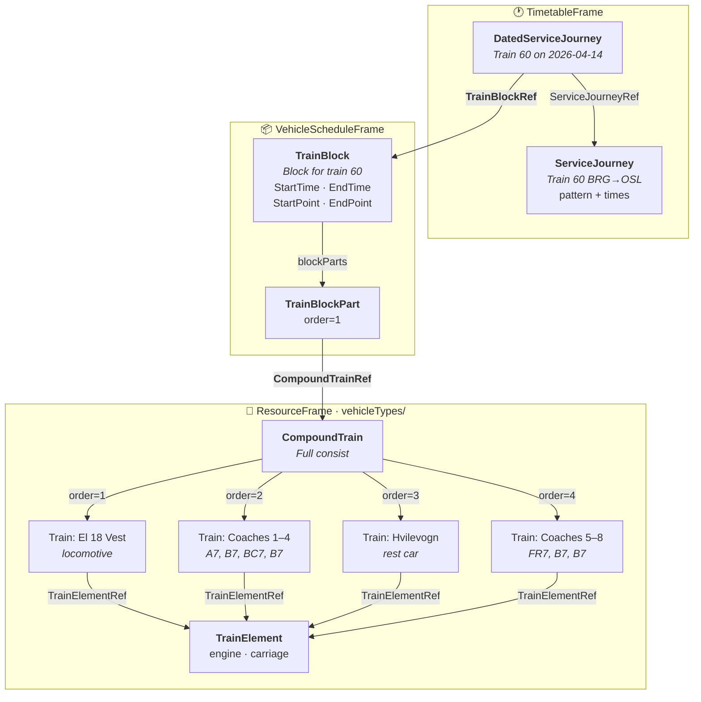

# 🚂 Rolling Stock — Linking Services to Trains

## 1. 🎯 Introduction

> **vehicle** /ˈviːɪk(ə)l/ *noun*
> A thing used for transporting people or goods, especially on land, such as a car, lorry, or cart.
> — *Oxford English Dictionary*

In railway NeTEx, a "vehicle" is not a single atomic thing. A train departing Bergen for Oslo may consist of an electric **locomotive**, four **passenger carriages**, a **rest car**, and three additional **coaches** — all coupled together into a single formation that operates as one unit.

This guide explains how NeTEx models this reality: from the abstract service the passenger sees, through the dated operational assignment, down to the physical composition of the train.

In this guide you will learn:
- 🔗 The full linking chain from ServiceJourney to physical rolling stock
- 🚃 How Train, CompoundTrain, and TrainElement model formations
- 📦 How TrainBlock and TrainBlockPart assign formations to journeys
- 🎫 Train identity: PublicCode vs Operational Train Number
- 📋 A complete validated XML example based on real Norwegian rail data

---

## 2. 🔗 The Full Linking Chain

The path from "passenger sees departure at 06:19" to "locomotive El 18 + 9 carriages" traverses several objects across multiple frames:



### Summary Table

| Object | Frame | Role | Key References |
|--------|-------|------|----------------|
| **ServiceJourney** | TimetableFrame | Pattern + times (template) | JourneyPatternRef, LineRef, parts/JourneyPart |
| **DatedServiceJourney** | TimetableFrame | Date-specific instance | ServiceJourneyRef, OperatingDayRef, **TrainBlockRef** |
| **TrainBlock** | VehicleScheduleFrame | Vehicle duty for one day | StartPointRef, EndPointRef, blockParts |
| **TrainBlockPart** | (inside TrainBlock) | Segment with one formation | **CompoundTrainRef**, journeyParts |
| **CompoundTrain** | ResourceFrame | Full train consist | components/TrainInCompoundTrain |
| **Train** | ResourceFrame | Logical sub-unit (e.g. coach set) | components/TrainComponent |
| **TrainElement** | ResourceFrame (vehicles/) | Single physical wagon/engine | TrainElementType |

---

## 3. 🚃 Train Composition Model

NeTEx uses a three-level hierarchy for train formations:

### Level 1: TrainElement — The Physical Unit

A **TrainElement** represents a single indivisible unit: one locomotive, one carriage, one power car. It lives in `ResourceFrame/vehicles/`:

```xml
<TrainElement version="0" id="VYG:TrainElement:EL_18">
  <Name>Elektrisk lokomotiv type 18</Name>
  <TrainElementType>engine</TrainElementType>
</TrainElement>

<TrainElement version="0" id="VYG:TrainElement:B7-4">
  <Name>Personvogn type 7 B7-4</Name>
  <TrainElementType>carriage</TrainElementType>
</TrainElement>
```

### Level 2: Train — A Logical Group

A **Train** groups one or more TrainElements into a coupled unit (e.g. a locomotive, a coach set, or a single railcar). It lives in `ResourceFrame/vehicleTypes/`:

```xml
<Train version="0" id="VYG:Train:18_V">
  <Name>El 18 Vest</Name>
  <Description>EL18 lok dedikert trafikkpakke 3 Vest</Description>
  <TypeOfFuel>electricity</TypeOfFuel>
  <components>
    <TrainComponent order="1" version="0" id="VYG:TrainComponent:18_V_1">
      <TrainElementRef ref="VYG:TrainElement:EL_18" version="0"/>
      <OperationalOrientation>backwards</OperationalOrientation>
    </TrainComponent>
  </components>
</Train>
```

### Level 3: CompoundTrain — The Full Consist

A **CompoundTrain** composes multiple Trains into the actual formation running on the track. It is the object referenced by TrainBlockPart:

```xml
<CompoundTrain version="0" id="VYG:CompoundTrain:60_BRG-OSL">
  <Description>El 18 + 4 coaches + rest car + 3 coaches</Description>
  <components>
    <TrainInCompoundTrain order="1" version="0" id="VYG:TrainInCompoundTrain:60_1">
      <TrainRef ref="VYG:Train:18_V" version="0"/>
    </TrainInCompoundTrain>
    <TrainInCompoundTrain order="2" version="0" id="VYG:TrainInCompoundTrain:60_2">
      <TrainRef ref="VYG:Train:Coaches_1-4" version="0"/>
    </TrainInCompoundTrain>
    <TrainInCompoundTrain order="3" version="0" id="VYG:TrainInCompoundTrain:60_3">
      <TrainRef ref="VYG:Train:RestCar" version="0"/>
    </TrainInCompoundTrain>
    <TrainInCompoundTrain order="4" version="0" id="VYG:TrainInCompoundTrain:60_4">
      <TrainRef ref="VYG:Train:Coaches_5-7" version="0"/>
    </TrainInCompoundTrain>
  </components>
</CompoundTrain>
```

> [!NOTE]
> The `order` attribute defines the physical position in the train from front to back. This is critical for seat reservation systems and platform positioning.

---

## 4. 📦 TrainBlock and TrainBlockPart

### TrainBlock — The Operational Duty

A **TrainBlock** represents what a physical train set does on one operating day. It groups all journey segments and defines when and where the duty starts and ends:

```xml
<TrainBlock version="0" id="VYG:TrainBlock:60_BRG-OSL_20260414">
  <StartTime>06:19:00</StartTime>
  <EndTime>13:05:00</EndTime>
  <StartPointRef ref="VYG:ScheduledStopPoint:BRG"/>
  <EndPointRef ref="VYG:ScheduledStopPoint:OSL"/>
  <blockParts>
    <TrainBlockPart order="1" version="0" id="VYG:TrainBlockPart:60_BRG-OSL_20260414_1">
      <CompoundTrainRef ref="VYG:CompoundTrain:60_BRG-OSL"/>
      <journeyParts>
        <JourneyPartRef ref="VYG:JourneyPart:60_BRG-OSL_1" version="0"/>
      </journeyParts>
    </TrainBlockPart>
  </blockParts>
</TrainBlock>
```

### Why TrainBlockPart?

A train's formation may change during a block (coupling/uncoupling at intermediate stations). Each **TrainBlockPart** represents a segment with a **constant formation**:

```text
Block for train 601 (Oslo → Bergen):
  Part 1: Oslo → Hønefoss    (8 coaches)    ← CompoundTrainRef A
  Part 2: Hønefoss → Bergen  (6 coaches)    ← CompoundTrainRef B  (2 uncoupled)
```

> [!TIP]
> If the formation doesn't change during the journey, a single TrainBlockPart is sufficient. This is the most common case.

---

## 5. 🎫 Train Identity — Commercial vs Operational

A train has two identities:

| Identity | What | Where | Owner |
|----------|------|-------|-------|
| **Commercial** (passenger-facing) | "Tog 60" | `PublicCode` on ServiceJourney | Timetable team |
| **Operational** (dispatch/infra) | "4060" | `privateCodes/PrivateCode type="OperationalTrainNumber"` on TrainBlockPart | Operations team |

The operational train number (OTN) belongs on **TrainBlockPart** because:
- It can vary per **segment** (infrastructure boundaries, crew handover)
- It can vary per **date** (TrainBlock is day-specific)
- It is **operational data** (VehicleScheduleFrame), not public timetable data
- It binds naturally to the physical movement: "this formation, on this segment, on this day, is known as 4060"

```xml
<!-- TimetableFrame: passenger-facing identity -->
<ServiceJourney version="1" id="VYG:ServiceJourney:60-BRG_East">
  <Name>Tog 60</Name>
  <PublicCode>60</PublicCode>
  ...
</ServiceJourney>

<!-- VehicleScheduleFrame: operational identity per segment -->
<TrainBlockPart order="1" version="1" id="VYG:TrainBlockPart:60_BRG-OSL_20260414_1">
  <privateCodes>
    <PrivateCode type="OperationalTrainNumber">4060</PrivateCode>
  </privateCodes>
  <CompoundTrainRef ref="VYG:CompoundTrain:60_BRG-OSL" version="1"/>
  <journeyParts>
    <JourneyPartRef ref="VYG:JourneyPart:60_BRG-OSL" version="1"/>
  </journeyParts>
</TrainBlockPart>
```

> [!NOTE]
> The NeTEx XSD also provides a dedicated `TrainNumber` object with `ForAdvertisement`/`ForProduction`. This adds indirection without value — `PublicCode` on ServiceJourney and `privateCodes` on TrainBlockPart cover both needs natively, at the correct ownership level, without coupling operational data into the public timetable.

---

## 6. 🔄 The Norwegian Pattern

In Norway (Nordic Profile), the standard pattern is:

```text
ServiceJourney     ← template: pattern, times, operator, line
     ↑ ServiceJourneyRef
DatedServiceJourney ← date-specific: one per operating day
     │ TrainBlockRef
     ↓
TrainBlock          ← vehicle duty: what the train set does
     │ blockParts/TrainBlockPart
     │      │ CompoundTrainRef
     ↓      ↓
CompoundTrain       ← full formation: loco + coaches in order
     │ components/TrainInCompoundTrain/TrainRef
     ↓
Train               ← logical group: one coupled sub-unit
     │ components/TrainComponent/TrainElementRef
     ↓
TrainElement        ← single physical wagon/engine
```

The **DatedServiceJourney** is the key linking object. Its `id` represents the unique combination of:
- **Operator** (via ServiceJourney → OperatorRef)
- **Service identity** (via ServiceJourney → PublicCode)
- **Departure date** (via OperatingDayRef)

---

## 7. 📋 Practical Example

The following example models a simplified version of Vy's train 60 (Bergen → Oslo S) on the Bergensbanen:

**Scenario:**
- Line F4 (Bergensbanen)
- Train number 60, Bergen → Oslo
- Formation: El 18 locomotive + 4 Type 7 coaches (A7, B7, BC7, B7) + 1 rest car (BFWL) + 3 more coaches (FR7, B7, B7)
- One operating day: 2026-04-14

📄 **Full example:** [Example_RollingStock.xml](Example_RollingStock.xml)

---

## 8. ✅ Best Practices

> [!TIP]
> - **Start from the passenger view** (ServiceJourney) and work down to physical equipment — not the other way around.
> - **Use CompoundTrain** when a train has locomotive + carriages (most long-distance). Use a plain **Train** for EMU/DMU sets that are a single unit.
> - **One TrainBlock per physical train set per operating day.** Never mix dates.
> - **Use TrainBlockPart** whenever formation changes mid-journey (coupling/uncoupling). Otherwise, one part is fine.
> - **Keep TrainElements simple** — Name and TrainElementType (`engine` or `carriage`) are sufficient for most use cases.
> - **Don't duplicate formation data** across dates — define CompoundTrain once and reference from multiple TrainBlockParts.

---

## 9. ❌ Common Mistakes

| Mistake | Why It Fails | Fix |
|---------|-------------|-----|
| Putting Train/CompoundTrain in VehicleScheduleFrame | XSD requires them in ResourceFrame/vehicleTypes | Move to `vehicleTypes` in ResourceFrame |
| Using VehicleTypeRef for specific formation assignment | VehicleTypeRef is a generic hint, not dated assignment | Use DatedServiceJourney → TrainBlockRef → TrainBlockPart → CompoundTrainRef |
| Missing DatedServiceJourney in chain | ServiceJourney alone can't carry date-specific block assignment | Always create DatedServiceJourney as the linking object |
| TrainElement in vehicleTypes instead of vehicles | XSD places TrainElement under ResourceFrame/vehicles | Check container: `vehicleTypes` for Train/CompoundTrain, `vehicles` for TrainElement |
| TrainBlockRef on ServiceJourney (not DatedServiceJourney) | The XSD allows BlockRef on ServiceJourney, but for rail the assignment is date-specific | Use TrainBlockRef on DatedServiceJourney for date-variant formations |

---

## 10. 🔗 Related Resources

### Guides
- [Vehicle Scheduling](../VehicleScheduling/VehicleScheduling_Guide.md) — General Block/VehicleType patterns (bus and rail)
- [Journey Lifecycle](../JourneyLifecycle/JourneyLifecycle_Guide.md) — How ServiceJourney and DatedServiceJourney relate
- [Separation of Concerns](../SeparationOfConcerns/SeparationOfConcerns.md) — Why timetable and vehicle domains are separated

### Frames & Objects
- [VehicleScheduleFrame](../../Frames/VehicleScheduleFrame/Table_VehicleScheduleFrame.md) — Where TrainBlock lives
- [ResourceFrame](../../Frames/ResourceFrame/Table_ResourceFrame.md) — Where Train/CompoundTrain/TrainElement are defined
- [TrainBlock](../../Objects/TrainBlock/Table_TrainBlock.md) — Block object specification
- [VehicleType](../../Objects/VehicleType/Table_VehicleType.md) — Generic vehicle type (parent of Train)
- [DatedServiceJourney](../../Objects/DatedServiceJourney/Table_DatedServiceJourney.md) — Date-specific journey with BlockRef
- [ServiceJourney](../../Objects/ServiceJourney/Table_ServiceJourney.md) — Journey template

### External
- [NeTEx CEN Standard](https://www.netex-cen.eu/) — Official specification
- [NeTEx GitHub — Vehicle Service XSD](https://github.com/NeTEx-CEN/NeTEx/blob/main/xsd/netex_part_2/part2_vehicleService/netex_vehicleService_version.xsd) — TrainBlock/TrainBlockPart type definitions
- [CEN GitHub Issue #228](https://github.com/NeTEx-CEN/NeTEx/issues/228) — Discussion on vehicle-to-service linking patterns
