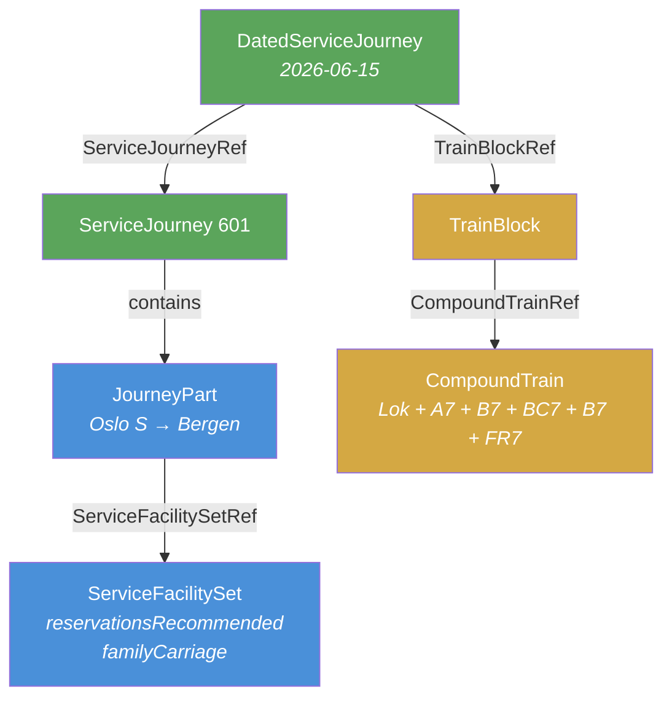

# 🎫 Seating Reservation & Booking

## 1. 🎯 Introduction

Long-distance rail services often require or recommend seat reservations. NeTEx provides a structured way to express reservation policies — from "reservations recommended" for daytime trains to "reservations compulsory" for night trains with sleeping berths. This guide explains how to model these reservation requirements so that journey planners, ticket sales systems, and passenger information displays present the correct booking expectations to travellers.

In this guide you will learn:
- 🎫 How reservation policies are expressed through `ServiceFacilitySet`
- 🛋️ How accommodation types (family carriage, sleeper, couchette) are declared
- 🔗 How `JourneyPart` links a service to its reservation policy
- 🚂 How `TrainBlock` and `CompoundTrain` express the physical formation
- 📅 How `DatedServiceJourney` ties everything together for a specific operating day

---

## 2. 🧩 Core Concepts

Seat reservation in NeTEx is not a single element — it is expressed through the interaction of several objects across multiple frames:

```text
ServiceFacilitySet               ← WHAT facilities: reservation policy + accommodation type
    ↑ referenced by
JourneyPart                      ← WHICH segment of a journey has these facilities
    ↑ contained in
ServiceJourney                   ← The timetable journey template
    ↑ referenced by
DatedServiceJourney              ← A specific date the journey operates
    ↓ references
TrainBlock → CompoundTrain       ← WHICH physical train runs on that date
```

### Reservation policy vs. accommodation type

These are two separate concepts that work together:

| Concept | NeTEx Element | Example Values |
|---------|---------------|----------------|
| **Reservation policy** | `ServiceReservationFacilityList` | `reservationsRecommended`, `reservationsCompulsory`, `noReservationsPossible` |
| **Accommodation type** | `AccommodationFacilityList` | `familyCarriage`, `singleSleeper`, `doubleSleeper`, `couchette`, `recliningSeats` |

A day train might have `reservationsRecommended` with `familyCarriage` accommodation, while a night train has `reservationsCompulsory` with `singleSleeper doubleSleeper`.

### Available reservation policy values

The `ServiceReservationFacilityList` uses the `ReservationEnumeration` from UIC 7037:

| Value | Meaning |
|-------|---------|
| `reservationsCompulsory` | Passengers **must** reserve a seat/berth before boarding |
| `reservationsCompulsoryForGroups` | Groups must reserve; individuals may not need to |
| `reservationsCompulsoryForFirstClass` | First class requires reservation; standard class does not |
| `reservationsRecommended` | Reservation advised but not mandatory |
| `reservationsPossible` | Reservation available but not expected |
| `noReservationsPossible` | Open seating only — no reservation system |
| `bicycleReservationsCompulsory` | Bicycle spaces must be reserved |
| `wheelchairOnlyReservations` | Only wheelchair spaces require reservation |

---

## 3. 🏗️ How It Works in NeTEx

### Frame and object mapping

| Frame | Object | Role in Reservation |
|-------|--------|---------------------|
| **TimetableFrame** | `ServiceFacilitySet` | Declares reservation policy and accommodation types |
| **TimetableFrame** | `ServiceJourney` → `JourneyPart` | Links the journey to a `ServiceFacilitySetRef` |
| **TimetableFrame** | `DatedServiceJourney` | Ties a journey to a specific date and `TrainBlockRef` |
| **VehicleScheduleFrame** | `TrainBlock` → `TrainBlockPart` | Links journey to physical formation via `CompoundTrainRef` |
| **ResourceFrame** | `Train` / `CompoundTrain` | Defines the physical carriage composition |

### The data flow



---

## 4. 📝 Practical Examples

This guide includes a complete validated XML example demonstrating two scenarios on the Oslo–Bergen line (Bergensbanen):

📄 **Full example:** [Example_SeatingReservation_NP.xml](Example_SeatingReservation_NP.xml)

### Scenario 1: Day train — reservations recommended

A daytime regional rail service where passengers are encouraged to reserve seats but may board without reservation if space is available.

**Key characteristics:**
- `RailSubmode`: `regionalRail`
- `FareClasses`: `businessClass economyClass` (Komfort + Standard)
- `AccommodationFacilityList`: `familyCarriage`
- `ServiceReservationFacilityList`: `reservationsRecommended`

#### ServiceFacilitySet (reservation policy)

```xml
<ServiceFacilitySet id="NP:ServiceFacilitySet:DayTrain" version="1">
  <!-- FacilitySetGroup elements (inherited) -->
  <CateringFacilityList>snacks</CateringFacilityList>
  <FareClasses>businessClass economyClass</FareClasses>
  <MobilityFacilityList>suitableForPushchairs suitableForWheelchairs</MobilityFacilityList>
  <NuisanceFacilityList>breastfeedingFriendly animalsAllowed</NuisanceFacilityList>
  <PassengerCommsFacilityList>publicWifi</PassengerCommsFacilityList>
  <!-- ServiceFacilityGroup elements -->
  <AccommodationFacilityList>familyCarriage</AccommodationFacilityList>
  <LuggageCarriageFacilityList>cyclesAllowed</LuggageCarriageFacilityList>
  <ServiceReservationFacilityList>reservationsRecommended</ServiceReservationFacilityList>
</ServiceFacilitySet>
```

#### JourneyPart (linking journey to facility set)

The `ServiceJourney` contains a `JourneyPart` that references the `ServiceFacilitySet`:

```xml
<ServiceJourney id="NP:ServiceJourney:601" version="1">
  <Name>601</Name>
  <TransportMode>rail</TransportMode>
  <TransportSubmode>
    <RailSubmode>regionalRail</RailSubmode>
  </TransportSubmode>
  <!-- ... passingTimes ... -->
  <parts>
    <JourneyPart id="NP:JourneyPart:601-1" version="1">
      <Description>Oslo S – Bergen</Description>
      <MainPartRef ref="NP:JourneyPart:601-1" version="1"/>
      <TrainNumberRef ref="NP:TrainNumber:601"/>
      <FromStopPointRef ref="NP:ScheduledStopPoint:OSL"/>
      <ToStopPointRef ref="NP:ScheduledStopPoint:BRG"/>
      <StartTime>12:03:00</StartTime>
      <EndTime>17:08:00</EndTime>
      <facilities>
        <ServiceFacilitySetRef ref="NP:ServiceFacilitySet:DayTrain" version="1"/>
      </facilities>
    </JourneyPart>
  </parts>
</ServiceJourney>
```

#### DatedServiceJourney (date + formation assignment)

```xml
<DatedServiceJourney id="NP:DatedServiceJourney:601_2026-06-15" version="1">
  <TrainBlockRef ref="NP:TrainBlock:601-Day" version="1"/>
  <ServiceJourneyRef ref="NP:ServiceJourney:601" version="1"/>
  <OperatingDayRef ref="NP:OperatingDay:2026-06-15" version="1"/>
</DatedServiceJourney>
```

---

### Scenario 2: Night train — reservations compulsory

An overnight service with sleeping wagons where every passenger must have a reserved berth or seat.

**Key characteristics:**
- `RailSubmode`: `nightRail`
- `FareClasses`: `economyClass`
- `AccommodationFacilityList`: `doubleSleeper singleSleeper`
- `ServiceReservationFacilityList`: `reservationsCompulsory`

#### ServiceFacilitySet (sleeper + compulsory reservation)

```xml
<ServiceFacilitySet id="NP:ServiceFacilitySet:NightTrain" version="1">
  <CateringFacilityList>snacks</CateringFacilityList>
  <FareClasses>economyClass</FareClasses>
  <MobilityFacilityList>suitableForWheelchairs</MobilityFacilityList>
  <NuisanceFacilityList>animalsAllowed</NuisanceFacilityList>
  <PassengerCommsFacilityList>publicWifi</PassengerCommsFacilityList>
  <AccommodationFacilityList>doubleSleeper singleSleeper</AccommodationFacilityList>
  <LuggageCarriageFacilityList>cyclesAllowed</LuggageCarriageFacilityList>
  <ServiceReservationFacilityList>reservationsCompulsory</ServiceReservationFacilityList>
</ServiceFacilitySet>
```

> [!NOTE]
> The `nightRail` submode on the `ServiceJourney` signals to consumers that this is an overnight train. Combined with `reservationsCompulsory` and sleeper accommodation, the full picture is clear: this is a book-ahead night service.

#### Night train formation (sleeping wagons)

The physical train composition for night services includes WLAB sleeping wagons:

```xml
<CompoundTrain id="NP:CompoundTrain:NightTrain-605" version="1">
  <Description>Night train: Lok + WLAB + WLAB + B7 + FR7</Description>
  <components>
    <TrainInCompoundTrain id="NP:TrainInCompoundTrain:Night605-1" version="1" order="1">
      <TrainRef ref="NP:Train:Lok18" version="1"/>          <!-- Locomotive -->
    </TrainInCompoundTrain>
    <TrainInCompoundTrain id="NP:TrainInCompoundTrain:Night605-2" version="1" order="2">
      <TrainRef ref="NP:Train:WLAB-1" version="1"/>         <!-- Sleeping wagon -->
    </TrainInCompoundTrain>
    <TrainInCompoundTrain id="NP:TrainInCompoundTrain:Night605-3" version="1" order="3">
      <TrainRef ref="NP:Train:WLAB-2" version="1"/>         <!-- Sleeping wagon -->
    </TrainInCompoundTrain>
    <TrainInCompoundTrain id="NP:TrainInCompoundTrain:Night605-4" version="1" order="4">
      <TrainRef ref="NP:Train:B7-Night" version="1"/>       <!-- Seated coach -->
    </TrainInCompoundTrain>
    <TrainInCompoundTrain id="NP:TrainInCompoundTrain:Night605-5" version="1" order="5">
      <TrainRef ref="NP:Train:FR7-Bistro" version="1"/>     <!-- Bistro coach -->
    </TrainInCompoundTrain>
  </components>
</CompoundTrain>
```

---

## 5. 💡 Best Practices

> [!TIP]
> - **Always set `ServiceReservationFacilityList`** on services where reservation applies — omitting it leaves consumers guessing.
> - **Use `AccommodationFacilityList`** to declare accommodation types (sleeper, family, etc.) — this is critical for sales systems showing available products.
> - **Link facilities at the `JourneyPart` level**, not the `ServiceJourney` level — a single journey may have different facility sets for different segments (e.g., a train that splits at a station).
> - **Different formations on different dates** are modelled by creating multiple `TrainBlock` objects and assigning the appropriate one via `DatedServiceJourney` → `TrainBlockRef`.
> - **Use `nightRail` submode** for overnight trains — it complements the facility data with a consumer-facing transport classification.
> - **Element order matters** — `ServiceFacilitySet` elements must follow XSD sequence order: `CateringFacilityList` → `FareClasses` → `MobilityFacilityList` → `NuisanceFacilityList` → `PassengerCommsFacilityList` → `AccommodationFacilityList` → `LuggageCarriageFacilityList` → `ServiceReservationFacilityList`.

> [!WARNING]
> - **Do not confuse `AccommodationFacilityList` with `ServiceReservationFacilityList`** — the former describes *what kind of seating/berth* is available, the latter describes *whether reservation is required*.
> - **Do not omit `DatedServiceJourney` → `TrainBlockRef`** for services where formation matters — without it, consumers cannot determine the actual carriage consist for a specific date.
> - **Do not place `ServiceFacilitySet` in the wrong frame** — it belongs in the `TimetableFrame`, not `ServiceFrame` or `ResourceFrame`.

---

## 6. 📊 Summary: What to Provide and Why

| Data Element | Frame | Why It's Needed |
|-------------|-------|-----------------|
| `ServiceFacilitySet` with `ServiceReservationFacilityList` | TimetableFrame | Tells consumers whether reservation is required, recommended, or not possible |
| `ServiceFacilitySet` with `AccommodationFacilityList` | TimetableFrame | Describes available accommodation (family carriage, sleeper, couchette) |
| `ServiceFacilitySet` with `FareClasses` | TimetableFrame | Lists available classes (business/economy) for reservation systems |
| `ServiceJourney` → `JourneyPart` → `ServiceFacilitySetRef` | TimetableFrame | Links a journey segment to its facilities and reservation policy |
| `ServiceJourney` with `TransportSubmode` (`nightRail`) | TimetableFrame | Signals overnight service to journey planners |
| `DatedServiceJourney` → `TrainBlockRef` | TimetableFrame | Assigns a specific physical formation for a specific date |
| `TrainBlock` → `CompoundTrainRef` | VehicleScheduleFrame | Identifies which carriages form the train on that date |
| `CompoundTrain` → `Train` → `TrainComponent` | ResourceFrame | Defines the exact carriage composition and order |

---

## 7. 🔗 Related Resources

### Guides
- [Vehicle Scheduling](../VehicleScheduling/VehicleScheduling_Guide.md) — Blocks, VehicleType, Vehicle, and fleet assignment
- [Journey Lifecycle](../JourneyLifecycle/JourneyLifecycle_Guide.md) — Line → Route → JourneyPattern → ServiceJourney → DatedServiceJourney
- [Extended Sales & Deviation Handling](../ExtendedSales_and_DeviationHandling/ExtendedSales_and_DeviationHandling_Guide.md) — DatedServiceJourney.id as sales key
- [Passenger Information](../PassengerInformation/PassengerInformation_Guide.md) — DestinationDisplay, Notice, and FlexibleServiceProperties

### Frames & Objects
- [TimetableFrame](../../Frames/TimetableFrame/Table_TimetableFrame.md) — Journey scheduling
- [VehicleScheduleFrame](../../Frames/VehicleScheduleFrame/Table_VehicleScheduleFrame.md) — Block assignments
- [ServiceJourney](../../Objects/ServiceJourney/Table_ServiceJourney.md) — Journey definitions
- [DatedServiceJourney](../../Objects/DatedServiceJourney/Table_DatedServiceJourney.md) — Date-specific journey instances
- [TrainBlock](../../Objects/TrainBlock/Table_TrainBlock.md) — Train block assignments
- [VehicleType](../../Objects/VehicleType/Table_VehicleType.md) — Train/CompoundTrain definitions

### External
- [NeTEx CEN Standard](https://www.netex-cen.eu/) — Official specification
- [UIC 7037 Code List](https://www.uic.org/) — Reservation facility codes used by `ReservationEnumeration`
