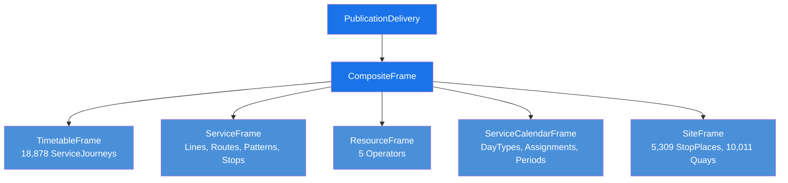

# Slovenian NeTEx Profile Analysis (SLO)

## Introduction

This guide documents the analysis of the **Slovenian National Access Point (NAP)** NeTEx data delivery, based on the file `NETEX_PI_01_SI_NAP_NETWORK_20260407.xml`. The file follows the **EU_PI (Passenger Information)** profile version `2.0:EU_PI-1.0` and contains a complete national transit dataset covering bus and rail services across Slovenia.

The analysis maps every NeTEx object used in the Slovenian delivery to the profile documentation framework, identifies structural patterns, and highlights differences from existing profiles (MIN, NP, FR).

> [!NOTE]
> The Slovenian dataset uses a single `PublicationDelivery` containing one `CompositeFrame` with five inner frames: TimetableFrame, ServiceFrame, ResourceFrame, ServiceCalendarFrame, and SiteFrame.

---

## Core Concepts

### Codespace and Identifier Pattern

The Slovenian data uses the codespace prefix **`SI:SI0`** with a consistent identifier pattern:

```
SI:SI0:<ObjectType>:<UUID>:IJPP
```

- **SI** — Country code for Slovenia
- **SI0** — Data source identifier
- **IJPP** — Suffix identifying the Integriran javni potniški promet (Integrated Public Passenger Transport) system
- **NAP** — ParticipantRef used at the frame level

### FrameDefaults

| Setting | Value |
|---------|-------|
| DefaultLanguage | `sl` (Slovenian) |
| TimeZone | `CET` |
| SummerTimeZoneOffset | `+1` |
| DefaultCurrency | `EUR` |
| DefaultLocale/DefaultLanguage | `sl` |
| LocationSystem | `WGS84` |

### Transport Modes

The dataset covers two transport modes:
- **bus** — dominant mode with 4 operators (LPP, Nomago, APMS, Arriva)
- **rail** — operated by SŽ (Slovenske železnice / Slovenian Railways)

---

## How It Works in NeTEx

### Frame Structure

The Slovenian delivery packages all data in a single `CompositeFrame` within a `PublicationDelivery`:



### Data Volume

| Object | Count |
|--------|------:|
| ServiceJourney | 18,878 |
| ServiceJourneyPattern | 9,634 |
| Line | 2,513 |
| Route | 9,634 |
| ScheduledStopPoint | 9,778 |
| StopPlace | 5,309 |
| Quay | 10,011 |
| PassengerStopAssignment | 9,778 |
| Operator | 5 |
| DayType | 115 |
| DayTypeAssignment | 3,968 |
| OperatingPeriod | 128 |

### Operators

| Name | ID Suffix | Mode |
|------|-----------|------|
| LPP (Javni holding Ljubljana) | `...0460` | bus |
| Nomago | `...045f` | bus |
| APMS (Murska Sobota) | `...0461` | bus |
| Arriva Slovenija | `...0463` | bus |
| SŽ (Slovenske železnice) | `...0489` | rail |

---

## Practical Examples

### Object Mapping

Each NeTEx object found in the Slovenian data has a corresponding example snippet in the Objects folder. The table below maps objects to their SLO example files:

| Object | Frame | SLO Example | Key Characteristics |
|--------|-------|-------------|---------------------|
| [Operator](../../Objects/Operator/Table_Operator.md) | ResourceFrame | [Example_Operator_SLO.xml](../../Objects/Operator/Example_Operator_SLO.xml) | 5 operators, no ContactDetails |
| [Line](../../Objects/Line/Table_Line.md) | ServiceFrame | [Example_Line_SLO.xml](../../Objects/Line/Example_Line_SLO.xml) | bus + rail, PublicCode + PrivateCode, no submode |
| [Route](../../Objects/Route/Table_Route.md) | ServiceFrame | [Example_Route_SLO.xml](../../Objects/Route/Example_Route_SLO.xml) | LineRef, PointOnRoute with RoutePointRef |
| [ScheduledStopPoint](../../Objects/ScheduledStopPoint/Table_ScheduledStopPoint.md) | ServiceFrame | [Example_ScheduledStopPoint_SLO.xml](../../Objects/ScheduledStopPoint/Example_ScheduledStopPoint_SLO.xml) | Name only, no Location |
| [StopPlace](../../Objects/StopPlace/Table_StopPlace.md) | SiteFrame | [Example_StopPlace_SLO.xml](../../Objects/StopPlace/Example_StopPlace_SLO.xml) | PostalAddress, Centroid, placeTypes, nested Quays |
| [Quay](../../Objects/Quay/Table_Quay.md) | SiteFrame | [Example_Quay_SLO.xml](../../Objects/Quay/Example_Quay_SLO.xml) | Covered=unknown, QuayType, Centroid |
| [ServiceJourney](../../Objects/ServiceJourney/Table_ServiceJourney.md) | TimetableFrame | [Example_ServiceJourney_SLO.xml](../../Objects/ServiceJourney/Example_ServiceJourney_SLO.xml) | Inline DayTypeRef list, ServiceJourneyPatternRef |
| [JourneyPattern](../../Objects/JourneyPattern/Table_JourneyPattern.md) | ServiceFrame | [Example_JourneyPattern_SLO.xml](../../Objects/JourneyPattern/Example_JourneyPattern_SLO.xml) | ServiceJourneyPattern, includes linksInSequence |
| [StopPointInJourneyPattern](../../Objects/StopPointInJourneyPattern/Table_StopPointInJourneyPattern.md) | ServiceFrame | [Example_StopPointInJourneyPattern_SLO.xml](../../Objects/StopPointInJourneyPattern/Example_StopPointInJourneyPattern_SLO.xml) | ForAlighting/ForBoarding flags |
| [PassengerStopAssignment](../../Objects/PassengerStopAssignment/Table_PassengerStopAssignment.md) | ServiceFrame | [Example_PassengerStopAssignment_SLO.xml](../../Objects/PassengerStopAssignment/Example_PassengerStopAssignment_SLO.xml) | ScheduledStopPointRef + StopPlaceRef + QuayRef |
| [DayType](../../Objects/DayType/Table_DayType.md) | ServiceCalendarFrame | [Example_DayType_SLO.xml](../../Objects/DayType/Example_DayType_SLO.xml) | Slovenian names, DaysOfWeek + HolidayTypes |
| [DayTypeAssignment](../../Objects/DayTypeAssignment/Table_DayTypeAssignment.md) | ServiceCalendarFrame | [Example_DayTypeAssignment_SLO.xml](../../Objects/DayTypeAssignment/Example_DayTypeAssignment_SLO.xml) | OperatingDayRef based, isAvailable flag |
| [OperatingPeriod](../../Objects/OperatingPeriod/Table_OperatingPeriod.md) | ServiceCalendarFrame | [Example_OperatingPeriod_SLO.xml](../../Objects/OperatingPeriod/Example_OperatingPeriod_SLO.xml) | FromDate/ToDate with timezone offsets |
| [OperatingDay](../../Objects/OperatingDay/Table_OperatingDay.md) | ServiceCalendarFrame | [Example_OperatingDay_SLO.xml](../../Objects/OperatingDay/Example_OperatingDay_SLO.xml) | CalendarDate based |

### Notable Absences

The following objects commonly found in other profiles are **not present** in the Slovenian data:

| Object | Notes |
|--------|-------|
| Authority | No transport authority defined; operators stand alone |
| Network | Lines are not grouped into networks |
| GroupOfLines | No line grouping used |
| DestinationDisplay | No destination displays defined |
| Notice | No notices or footnotes |
| TopographicPlace | Not used; postal address on StopPlace instead |
| DatedServiceJourney | Only undated ServiceJourneys with DayType references |
| Vehicle / VehicleType | No vehicle information provided |

---

## Best Practices

> [!TIP]
> **Codespace consistency** — The `SI:SI0:...:IJPP` pattern is applied uniformly across all object types. The UUID segment in the middle encodes object-type information in its structure (e.g., `0002` for StopPlace, `0003` for Quay/ScheduledStopPoint, `0007` for Line, `0008` for Route/ServiceJourney).

> [!TIP]
> **DayType naming** — Slovenian DayType names use natural language descriptions in Slovenian (e.g., "Vozi vsak dan" = "Runs every day"), making calendar patterns human-readable in the source data.

> [!WARNING]
> - **Missing DestinationDisplay**: Service journeys do not reference DestinationDisplay objects, which may affect passenger information systems.
> - **No Authority layer**: The absence of Authority objects means there is no explicit contractual relationship modelled between transport authorities and operators.
> - **Covered=unknown**: All Quays declare `Covered` as `unknown`, providing no shelter information.

---

## Summary — SLO Profile Element Usage

| Profile Aspect | SLO Usage |
|----------------|-----------|
| Codespace prefix | `SI:SI0` |
| ID suffix | `IJPP` |
| Frame wrapper | Single CompositeFrame |
| Language | `sl` (Slovenian) |
| Currency | `EUR` |
| Timezone | `CET` (+1 summer) |
| Coordinate system | WGS84 |
| Transport modes | bus, rail |
| Calendar model | DayType → DayTypeAssignment → OperatingDay + OperatingPeriod |
| Journey model | ServiceJourney → ServiceJourneyPattern → StopPointInJourneyPattern |
| Stop model | StopPlace → Quay, linked via PassengerStopAssignment |
| Version strategy | `version="1"` (single version per object) |

---

## Related Resources

- [Get Started](/Guides/GetStarted/GetStarted_Guide.md) — Introduction to the NeTEx profile framework
- [Calendar Guide](/Guides/Calendar/Calendar_Guide.md) — DayType and calendar modelling patterns
- [Network Timetable](/Guides/NetworkTimetable/NetworkTimetable_Guide.md) — Service journey and pattern modelling
- [Stop Infrastructure](/Guides/StopInfrastructure/StopInfrastructure_Guide.md) — StopPlace and Quay structures
- [Frames Overview](/Guides/FramesOverview/FramesOverview_Guide.md) — Frame types and their relationships
- [Transport Modes](/Guides/TransportModes/TransportModes_Guide.md) — Mode and submode classification
